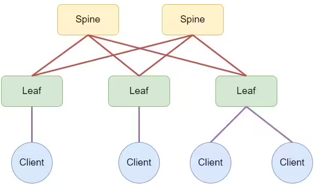

### Проектирование адресного пространства

### Цели
1. Собрать топологию CLOS как на схеме 



2. Распределить адресное пространство для Underlay сети
3. Зафиксировать в документации план работ, адресное пространство, схему сети, настройки

### Реализация


### ip план

| Устройство | Интерфейс | IP-адрес       | Loopback IP    | Дескрипшен                       |
|------------|-----------|----------------|----------------|----------------------------------|
| leaf-01    | eth7      | 10.10.10.0/31  | 10.0.0.1/32    | spine-01_et01                    |
               eth8      | 10.10.10.2/31  |                | spine-02_et01                    |
| leaf-02    | eth7      | 10.10.10.4/31  | 10.0.0.2/32    | spine-01_et02                    |
| leaf-02    | eth8      | 10.10.10.6/31  | 10.0.0.2/32    | spine-02_et02                    |
| leaf-03    | eth7      | 10.10.10.8/31  | 10.0.0.3/32    | spine-01_et03                    |
| leaf-03    | eth8      | 10.10.10.10/31 | 10.0.0.3/32    | spine-02_et03                    |
| spine-01   | eth1      | 10.10.10.1/31  | 10.0.0.4/32    | leaf-01_et7                      |
| spine-01   | eth2      | 10.10.10.5/31  | 10.0.0.4/32    | leaf-02_et7                      |
| spine-01   | eth3      | 10.10.10.9/31  | 10.0.0.4/32    | leaf-03_et7                      |
| spine-02   | eth1      | 10.10.10.3/31  | 10.0.0.5/32    | leaf-01_et8                      |
| spine-02   | eth2      | 10.10.10.7/31  | 10.0.0.5/32    | leaf-02_et8                      |
| spine-02   | eth3      | 10.10.10.11/31 | 10.0.0.5/32    | leaf-03_et8                      |


### Настройки устройств

<details>
<summary><b>leaf-01</b> (нажмите, чтобы раскрыть)</summary>

```cisco
hostname leaf-01
!
interface Ethernet7
 description spine-01_et01
 no switchport
 ip address 10.10.10.0/31
!
interface Ethernet8
 description spine-02_et01
 no switchport
 ip address 10.10.10.2/31
!
interface Loopback0
   ip address 10.0.0.1/32
```

</details>

<details>
<summary><b>leaf-02</b> (нажмите, чтобы раскрыть)</summary>

```cisco
hostname leaf-02
!
interface Ethernet7
 description spine-01_et02
 no switchport
 ip address 10.10.10.4/31
!
interface Ethernet8
 description spine-02_et02
 no switchport
 ip address 10.10.10.6/31
!
interface Loopback0
   ip address 10.0.0.2/32
```

</details>

<details>
<summary><b>leaf-03</b> (нажмите, чтобы раскрыть)</summary>

```cisco
hostname leaf-03
!
interface Ethernet7
 description spine-01_et03
 no switchport
 ip address 10.10.10.8/31
!
interface Ethernet8
 description spine-02_et03
 no switchport
 ip address 10.10.10.10/31
!
interface Loopback0
   ip address 10.0.0.3/32
```

</details>

<details>
<summary><b>spine-01</b> (нажмите, чтобы раскрыть)</summary>

```cisco
hostname spine-01
!
interface Ethernet1
 description leaf-01_et7
 no switchport
 ip address 10.10.10.1/31
!
interface Ethernet2
 description leaf-02_et7
 no switchport
 ip address 10.10.10.5/31
!
interface Ethernet3
 description leaf-03_et7
 no switchport
 ip address 10.10.10.9/31
!
interface Loopback0
   ip address 10.0.0.4/32
```

</details>

<details>
<summary><b>spine-02</b> (нажмите, чтобы раскрыть)</summary>

```cisco
hostname spine-02
!
interface Ethernet1
 description leaf-01_et8
 no switchport
 ip address 10.10.10.3/31
!
interface Ethernet2
 description leaf-02_et8
 no switchport
 ip address 10.10.10.7/31
!
interface Ethernet3
 description leaf-03_et8
 no switchport
 ip address 10.10.10.11/31
!
interface Loopback0
   ip address 10.0.0.5/32
```

</details>

### Проверка связности

```cisco
spine-01#sh ip int br
                                                                        Address
Interface        IP Address         Status      Protocol         MTU    Owner
---------------- ------------------ ----------- ------------- --------- -------
Ethernet1        10.10.10.1/31      up          up              1500
Ethernet2        10.10.10.5/31      up          up              1500
Ethernet3        10.10.10.9/31      up          up              1500
Management1      unassigned         down        down            1500

spine-01#ping 10.10.10.0
PING 10.10.10.0 (10.10.10.0) 72(100) bytes of data.
80 bytes from 10.10.10.0: icmp_seq=1 ttl=64 time=3.31 ms
80 bytes from 10.10.10.0: icmp_seq=2 ttl=64 time=0.656 ms
80 bytes from 10.10.10.0: icmp_seq=3 ttl=64 time=0.805 ms
80 bytes from 10.10.10.0: icmp_seq=4 ttl=64 time=0.602 ms
80 bytes from 10.10.10.0: icmp_seq=5 ttl=64 time=0.545 ms

--- 10.10.10.0 ping statistics ---
5 packets transmitted, 5 received, 0% packet loss, time 13ms
rtt min/avg/max/mdev = 0.545/1.183/3.308/1.065 ms, ipg/ewma 3.269/2.205 ms
spine-01#ping 10.10.10.4
PING 10.10.10.4 (10.10.10.4) 72(100) bytes of data.
80 bytes from 10.10.10.4: icmp_seq=1 ttl=64 time=3.47 ms
80 bytes from 10.10.10.4: icmp_seq=2 ttl=64 time=0.676 ms
80 bytes from 10.10.10.4: icmp_seq=3 ttl=64 time=0.768 ms
80 bytes from 10.10.10.4: icmp_seq=4 ttl=64 time=0.607 ms
80 bytes from 10.10.10.4: icmp_seq=5 ttl=64 time=0.598 ms

--- 10.10.10.4 ping statistics ---
5 packets transmitted, 5 received, 0% packet loss, time 15ms
rtt min/avg/max/mdev = 0.598/1.223/3.469/1.124 ms, ipg/ewma 3.669/2.304 ms
spine-01#ping 10.10.10.8
PING 10.10.10.8 (10.10.10.8) 72(100) bytes of data.
80 bytes from 10.10.10.8: icmp_seq=1 ttl=64 time=2.16 ms
80 bytes from 10.10.10.8: icmp_seq=2 ttl=64 time=0.779 ms
80 bytes from 10.10.10.8: icmp_seq=3 ttl=64 time=0.728 ms
80 bytes from 10.10.10.8: icmp_seq=4 ttl=64 time=0.623 ms
80 bytes from 10.10.10.8: icmp_seq=5 ttl=64 time=0.673 ms

--- 10.10.10.8 ping statistics ---
5 packets transmitted, 5 received, 0% packet loss, time 10ms
rtt min/avg/max/mdev = 0.623/0.992/2.157/0.584 ms, ipg/ewma 2.474/1.551 ms


spine-02#sh ip int br
                                                                        Address
Interface       IP Address          Status      Protocol         MTU    Owner
--------------- ------------------- ----------- ------------- --------- -------
Ethernet1       10.10.10.3/31       up          up              1500
Ethernet2       10.10.10.7/31       up          up              1500
Ethernet3       10.10.10.11/31      up          up              1500
Management1     unassigned          down        down            1500

spine-02#ping 10.10.10.2
PING 10.10.10.2 (10.10.10.2) 72(100) bytes of data.
80 bytes from 10.10.10.2: icmp_seq=1 ttl=64 time=2.56 ms
80 bytes from 10.10.10.2: icmp_seq=2 ttl=64 time=0.810 ms
80 bytes from 10.10.10.2: icmp_seq=3 ttl=64 time=0.588 ms
80 bytes from 10.10.10.2: icmp_seq=4 ttl=64 time=0.554 ms
80 bytes from 10.10.10.2: icmp_seq=5 ttl=64 time=0.550 ms

--- 10.10.10.2 ping statistics ---
5 packets transmitted, 5 received, 0% packet loss, time 11ms
rtt min/avg/max/mdev = 0.550/1.012/2.559/0.779 ms, ipg/ewma 2.843/1.753 ms
spine-02#ping 10.10.10.6
PING 10.10.10.6 (10.10.10.6) 72(100) bytes of data.
80 bytes from 10.10.10.6: icmp_seq=1 ttl=64 time=2.82 ms
80 bytes from 10.10.10.6: icmp_seq=2 ttl=64 time=0.619 ms
80 bytes from 10.10.10.6: icmp_seq=3 ttl=64 time=0.591 ms
80 bytes from 10.10.10.6: icmp_seq=4 ttl=64 time=0.555 ms
80 bytes from 10.10.10.6: icmp_seq=5 ttl=64 time=0.567 ms

--- 10.10.10.6 ping statistics ---
5 packets transmitted, 5 received, 0% packet loss, time 14ms
rtt min/avg/max/mdev = 0.555/1.031/2.824/0.896 ms, ipg/ewma 3.451/1.895 ms
spine-02#ping 10.10.10.10
PING 10.10.10.10 (10.10.10.10) 72(100) bytes of data.
80 bytes from 10.10.10.10: icmp_seq=1 ttl=64 time=2.80 ms
80 bytes from 10.10.10.10: icmp_seq=2 ttl=64 time=0.751 ms
80 bytes from 10.10.10.10: icmp_seq=3 ttl=64 time=0.674 ms
80 bytes from 10.10.10.10: icmp_seq=4 ttl=64 time=0.608 ms
80 bytes from 10.10.10.10: icmp_seq=5 ttl=64 time=0.584 ms

--- 10.10.10.10 ping statistics ---
5 packets transmitted, 5 received, 0% packet loss, time 12ms
rtt min/avg/max/mdev = 0.584/1.083/2.801/0.860 ms, ipg/ewma 2.987/1.908 ms
```

