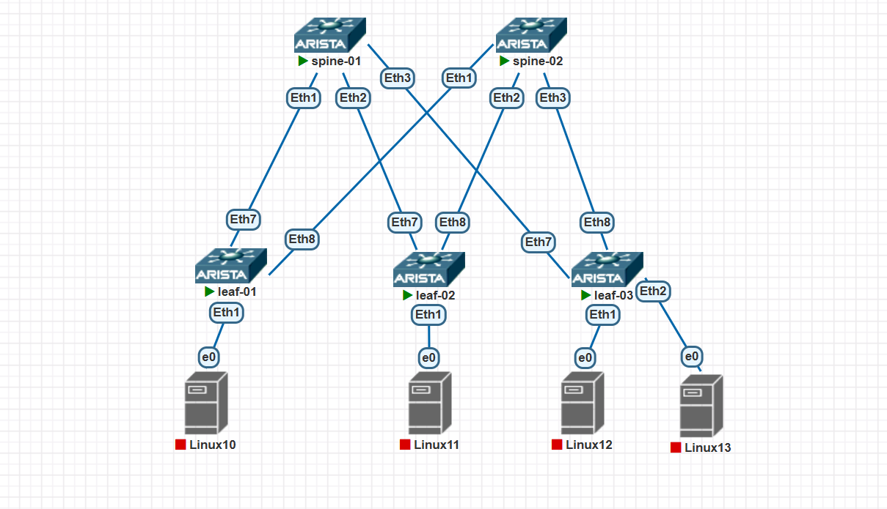

### Построение Underlay сети (IS-IS)

### Цели
1) Настроbnm ISIS в Underlay сети, для IP связанности между всеми сетевыми устройствами.
2) Зафиксирjdfnm в документации - план работы, адресное пространство, схему сети, конфигурацию устройств
3) Убедиться в наличии IP связанности между устройствами в ISIS домене.

### Реализация
Схема сети


### ip план

| Устройство | Интерфейс | IP-адрес       | Loopback IP    | Дескрипшен                       |
|------------|-----------|----------------|----------------|----------------------------------|
| leaf-01    | eth7      | 10.10.10.0/31  | 10.0.0.1/32    | spine-01_et1                     |
| leaf-01    | eth8      | 10.10.10.2/31  | 10.0.0.1/32    | spine-02_et1                     |
| leaf-02    | eth7      | 10.10.10.4/31  | 10.0.0.2/32    | spine-01_et2                     |
| leaf-02    | eth8      | 10.10.10.6/31  | 10.0.0.2/32    | spine-02_et2                     |
| leaf-03    | eth7      | 10.10.10.8/31  | 10.0.0.3/32    | spine-01_et3                     |
| leaf-03    | eth8      | 10.10.10.10/31 | 10.0.0.3/32    | spine-02_et3                     |
| spine-01   | eth1      | 10.10.10.1/31  | 10.0.0.4/32    | leaf-01_et7                      |
| spine-01   | eth2      | 10.10.10.5/31  | 10.0.0.4/32    | leaf-02_et7                      |
| spine-01   | eth3      | 10.10.10.9/31  | 10.0.0.4/32    | leaf-03_et7                      |
| spine-02   | eth1      | 10.10.10.3/31  | 10.0.0.5/32    | leaf-01_et8                      |
| spine-02   | eth2      | 10.10.10.7/31  | 10.0.0.5/32    | leaf-02_et8                      |
| spine-02   | eth3      | 10.10.10.11/31 | 10.0.0.5/32    | leaf-03_et8                      |


### Конфигурации
<details>
<summary><b>leaf-01</b> (нажмите, чтобы раскрыть)</summary>

```cisco
leaf-01#sh run sec isis
interface Ethernet7
   isis enable underlay
   isis network point-to-point
interface Ethernet8
   isis enable underlay
   isis network point-to-point
interface Loopback0
   isis enable underlay
router isis underlay
   net 49.0001.0000.0000.0001.00
   router-id ipv4 10.0.0.1
   !
   address-family ipv4 unicast
```

</details>

<details>
<summary><b>leaf-02</b> (нажмите, чтобы раскрыть)</summary>

```cisco
leaf-02#sh run sec isis
interface Ethernet7
   isis enable underlay
   isis network point-to-point
interface Ethernet8
   isis enable underlay
   isis network point-to-point
interface Loopback0
   isis enable underlay
router isis underlay
   net 49.0001.0000.0000.0002.00
   router-id ipv4 10.0.0.2
   !
   address-family ipv4 unicast
```

</details>

<details>
<summary><b>leaf-03</b> (нажмите, чтобы раскрыть)</summary>

```cisco
leaf-03#sh run sec isis
interface Ethernet7
   isis enable underlay
   isis network point-to-point
interface Ethernet8
   isis enable underlay
   isis network point-to-point
interface Loopback0
   isis enable underlay
router isis underlay
   net 49.0001.0000.0000.0003.00
   router-id ipv4 10.0.0.3
   !
   address-family ipv4 unicast
```

</details>

<details>
<summary><b>spine-01</b> (нажмите, чтобы раскрыть)</summary>

```cisco
spine-01#sh run sec isis
interface Ethernet1
   isis enable underlay
   isis network point-to-point
interface Ethernet2
   isis enable underlay
   isis network point-to-point
interface Ethernet3
   isis enable underlay
   isis network point-to-point
interface Loopback0
   isis enable underlay
router isis underlay
   net 49.0001.0000.0000.0004.00
   router-id ipv4 10.0.0.4
   !
   address-family ipv4 unicast
```

</details>

<details>
<summary><b>spine-02</b> (нажмите, чтобы раскрыть)</summary>

```cisco
spine-02#sh run sec isis
interface Ethernet1
   isis enable underlay
   isis network point-to-point
interface Ethernet2
   isis enable underlay
   isis network point-to-point
interface Ethernet3
   isis enable underlay
   isis network point-to-point
interface Loopback0
   isis enable underlay
router isis underlay
   net 49.0001.0000.0000.0005.00
   router-id ipv4 10.0.0.5
   !
   address-family ipv4 unicast
```

</details>

### Проверка соседства/распространения маршрутов
```cisco
leaf-01#sh isis neighbors

Instance  VRF      System Id        Type Interface          SNPA              State Hold time   Circuit Id
underlay  default  spine-01         L1L2 Ethernet7          P2P               UP    26          1F
underlay  default  spine-02         L1L2 Ethernet8          P2P               UP    24          13
leaf-01#sh ip route isis

VRF: default
Source Codes:
       C - connected, S - static, K - kernel,
       O - OSPF, IA - OSPF inter area, E1 - OSPF external type 1,
       E2 - OSPF external type 2, N1 - OSPF NSSA external type 1,
       N2 - OSPF NSSA external type2, B - Other BGP Routes,
       B I - iBGP, B E - eBGP, R - RIP, I L1 - IS-IS level 1,
       I L2 - IS-IS level 2, O3 - OSPFv3, A B - BGP Aggregate,
       A O - OSPF Summary, NG - Nexthop Group Static Route,
       V - VXLAN Control Service, M - Martian,
       DH - DHCP client installed default route,
       DP - Dynamic Policy Route, L - VRF Leaked,
       G  - gRIBI, RC - Route Cache Route,
       CL - CBF Leaked Route

 I L1     10.0.0.2/32 [115/30]
           via 10.10.10.1, Ethernet7
           via 10.10.10.3, Ethernet8
 I L1     10.0.0.3/32 [115/30]
           via 10.10.10.1, Ethernet7
           via 10.10.10.3, Ethernet8
 I L1     10.0.0.4/32 [115/20]
           via 10.10.10.1, Ethernet7
 I L1     10.0.0.5/32 [115/20]
           via 10.10.10.3, Ethernet8
 I L1     10.10.10.4/31 [115/20]
           via 10.10.10.1, Ethernet7
 I L1     10.10.10.6/31 [115/20]
           via 10.10.10.3, Ethernet8
 I L1     10.10.10.8/31 [115/20]
           via 10.10.10.1, Ethernet7
 I L1     10.10.10.10/31 [115/20]
           via 10.10.10.3, Ethernet8

leaf-01#ping 10.0.0.4
PING 10.0.0.4 (10.0.0.4) 72(100) bytes of data.
80 bytes from 10.0.0.4: icmp_seq=1 ttl=64 time=9.59 ms
80 bytes from 10.0.0.4: icmp_seq=2 ttl=64 time=0.805 ms
80 bytes from 10.0.0.4: icmp_seq=3 ttl=64 time=0.649 ms
80 bytes from 10.0.0.4: icmp_seq=4 ttl=64 time=0.677 ms
80 bytes from 10.0.0.4: icmp_seq=5 ttl=64 time=0.952 ms

--- 10.0.0.4 ping statistics ---
5 packets transmitted, 5 received, 0% packet loss, time 34ms
rtt min/avg/max/mdev = 0.649/2.534/9.589/3.528 ms, ipg/ewma 8.549/5.943 ms
leaf-01#ping 10.0.0.5
PING 10.0.0.5 (10.0.0.5) 72(100) bytes of data.
80 bytes from 10.0.0.5: icmp_seq=1 ttl=64 time=3.19 ms
80 bytes from 10.0.0.5: icmp_seq=2 ttl=64 time=0.775 ms
80 bytes from 10.0.0.5: icmp_seq=3 ttl=64 time=0.678 ms
80 bytes from 10.0.0.5: icmp_seq=4 ttl=64 time=0.595 ms
80 bytes from 10.0.0.5: icmp_seq=5 ttl=64 time=0.588 ms

--- 10.0.0.5 ping statistics ---
5 packets transmitted, 5 received, 0% packet loss, time 12ms
rtt min/avg/max/mdev = 0.588/1.165/3.192/1.015 ms, ipg/ewma 2.973/2.139 ms
leaf-01#ping 10.0.0.2
PING 10.0.0.2 (10.0.0.2) 72(100) bytes of data.
80 bytes from 10.0.0.2: icmp_seq=1 ttl=63 time=6.64 ms
80 bytes from 10.0.0.2: icmp_seq=2 ttl=63 time=1.53 ms
80 bytes from 10.0.0.2: icmp_seq=3 ttl=63 time=1.21 ms
80 bytes from 10.0.0.2: icmp_seq=4 ttl=63 time=1.43 ms
80 bytes from 10.0.0.2: icmp_seq=5 ttl=63 time=1.32 ms

--- 10.0.0.2 ping statistics ---
5 packets transmitted, 5 received, 0% packet loss, time 23ms
rtt min/avg/max/mdev = 1.212/2.426/6.644/2.111 ms, ipg/ewma 5.828/4.459 ms
leaf-01#ping 10.0.0.3
PING 10.0.0.3 (10.0.0.3) 72(100) bytes of data.
80 bytes from 10.0.0.3: icmp_seq=1 ttl=63 time=5.59 ms
80 bytes from 10.0.0.3: icmp_seq=2 ttl=63 time=1.49 ms
80 bytes from 10.0.0.3: icmp_seq=3 ttl=63 time=1.19 ms
80 bytes from 10.0.0.3: icmp_seq=4 ttl=63 time=1.18 ms
80 bytes from 10.0.0.3: icmp_seq=5 ttl=63 time=1.14 ms

--- 10.0.0.3 ping statistics ---
5 packets transmitted, 5 received, 0% packet loss, time 21ms
rtt min/avg/max/mdev = 1.139/2.116/5.586/1.739 ms, ipg/ewma 5.193/3.784 ms

leaf-02#sh isis neighbors

Instance  VRF      System Id        Type Interface          SNPA              State Hold time   Circuit Id
underlay  default  spine-01         L1L2 Ethernet7          P2P               UP    27          1E
underlay  default  spine-02         L1L2 Ethernet8          P2P               UP    23          17
leaf-02#
leaf-02#sh ip route isis

VRF: default
Source Codes:
       C - connected, S - static, K - kernel,
       O - OSPF, IA - OSPF inter area, E1 - OSPF external type 1,
       E2 - OSPF external type 2, N1 - OSPF NSSA external type 1,
       N2 - OSPF NSSA external type2, B - Other BGP Routes,
       B I - iBGP, B E - eBGP, R - RIP, I L1 - IS-IS level 1,
       I L2 - IS-IS level 2, O3 - OSPFv3, A B - BGP Aggregate,
       A O - OSPF Summary, NG - Nexthop Group Static Route,
       V - VXLAN Control Service, M - Martian,
       DH - DHCP client installed default route,
       DP - Dynamic Policy Route, L - VRF Leaked,
       G  - gRIBI, RC - Route Cache Route,
       CL - CBF Leaked Route

 I L1     10.0.0.1/32 [115/30]
           via 10.10.10.5, Ethernet7
           via 10.10.10.7, Ethernet8
 I L1     10.0.0.3/32 [115/30]
           via 10.10.10.5, Ethernet7
           via 10.10.10.7, Ethernet8
 I L1     10.0.0.4/32 [115/20]
           via 10.10.10.5, Ethernet7
 I L1     10.0.0.5/32 [115/20]
           via 10.10.10.7, Ethernet8
 I L1     10.10.10.0/31 [115/20]
           via 10.10.10.5, Ethernet7
 I L1     10.10.10.2/31 [115/20]
           via 10.10.10.7, Ethernet8
 I L1     10.10.10.8/31 [115/20]
           via 10.10.10.5, Ethernet7
 I L1     10.10.10.10/31 [115/20]
           via 10.10.10.7, Ethernet8

leaf-02#
leaf-02#ping 10.0.0.3
PING 10.0.0.3 (10.0.0.3) 72(100) bytes of data.
80 bytes from 10.0.0.3: icmp_seq=1 ttl=63 time=3.03 ms
80 bytes from 10.0.0.3: icmp_seq=2 ttl=63 time=1.27 ms
80 bytes from 10.0.0.3: icmp_seq=3 ttl=63 time=1.25 ms
80 bytes from 10.0.0.3: icmp_seq=4 ttl=63 time=1.22 ms
80 bytes from 10.0.0.3: icmp_seq=5 ttl=63 time=1.16 ms

--- 10.0.0.3 ping statistics ---
5 packets transmitted, 5 received, 0% packet loss, time 12ms
rtt min/avg/max/mdev = 1.159/1.585/3.027/0.721 ms, ipg/ewma 2.934/2.278 ms
leaf-02#ping 10.0.0.4
PING 10.0.0.4 (10.0.0.4) 72(100) bytes of data.
80 bytes from 10.0.0.4: icmp_seq=1 ttl=64 time=2.17 ms
80 bytes from 10.0.0.4: icmp_seq=2 ttl=64 time=0.673 ms
80 bytes from 10.0.0.4: icmp_seq=3 ttl=64 time=0.826 ms
80 bytes from 10.0.0.4: icmp_seq=4 ttl=64 time=0.840 ms
80 bytes from 10.0.0.4: icmp_seq=5 ttl=64 time=0.626 ms

--- 10.0.0.4 ping statistics ---
5 packets transmitted, 5 received, 0% packet loss, time 9ms
rtt min/avg/max/mdev = 0.626/1.027/2.174/0.579 ms, ipg/ewma 2.206/1.580 ms
leaf-02#ping 10.0.0.5
PING 10.0.0.5 (10.0.0.5) 72(100) bytes of data.
80 bytes from 10.0.0.5: icmp_seq=1 ttl=64 time=3.46 ms
80 bytes from 10.0.0.5: icmp_seq=2 ttl=64 time=1.25 ms
80 bytes from 10.0.0.5: icmp_seq=3 ttl=64 time=0.797 ms
80 bytes from 10.0.0.5: icmp_seq=4 ttl=64 time=0.884 ms
80 bytes from 10.0.0.5: icmp_seq=5 ttl=64 time=0.806 ms

--- 10.0.0.5 ping statistics ---
5 packets transmitted, 5 received, 0% packet loss, time 13ms
rtt min/avg/max/mdev = 0.797/1.438/3.458/1.023 ms, ipg/ewma 3.335/2.405 ms

leaf-03#sh isis neighbors

Instance  VRF      System Id        Type Interface          SNPA              State Hold time   Circuit Id
underlay  default  spine-01         L1L2 Ethernet7          P2P               UP    24          19
underlay  default  spine-02         L1L2 Ethernet8          P2P               UP    26          16
leaf-03#
leaf-03#sh ip route isis

VRF: default
Source Codes:
       C - connected, S - static, K - kernel,
       O - OSPF, IA - OSPF inter area, E1 - OSPF external type 1,
       E2 - OSPF external type 2, N1 - OSPF NSSA external type 1,
       N2 - OSPF NSSA external type2, B - Other BGP Routes,
       B I - iBGP, B E - eBGP, R - RIP, I L1 - IS-IS level 1,
       I L2 - IS-IS level 2, O3 - OSPFv3, A B - BGP Aggregate,
       A O - OSPF Summary, NG - Nexthop Group Static Route,
       V - VXLAN Control Service, M - Martian,
       DH - DHCP client installed default route,
       DP - Dynamic Policy Route, L - VRF Leaked,
       G  - gRIBI, RC - Route Cache Route,
       CL - CBF Leaked Route

 I L1     10.0.0.1/32 [115/30]
           via 10.10.10.9, Ethernet7
           via 10.10.10.11, Ethernet8
 I L1     10.0.0.2/32 [115/30]
           via 10.10.10.9, Ethernet7
           via 10.10.10.11, Ethernet8
 I L1     10.0.0.4/32 [115/20]
           via 10.10.10.9, Ethernet7
 I L1     10.0.0.5/32 [115/20]
           via 10.10.10.11, Ethernet8
 I L1     10.10.10.0/31 [115/20]
           via 10.10.10.9, Ethernet7
 I L1     10.10.10.2/31 [115/20]
           via 10.10.10.11, Ethernet8
 I L1     10.10.10.4/31 [115/20]
           via 10.10.10.9, Ethernet7
 I L1     10.10.10.6/31 [115/20]
           via 10.10.10.11, Ethernet8

leaf-03#
leaf-03#ping 10.0.0.4
PING 10.0.0.4 (10.0.0.4) 72(100) bytes of data.
80 bytes from 10.0.0.4: icmp_seq=1 ttl=64 time=1.36 ms
80 bytes from 10.0.0.4: icmp_seq=2 ttl=64 time=0.726 ms
80 bytes from 10.0.0.4: icmp_seq=3 ttl=64 time=0.624 ms
80 bytes from 10.0.0.4: icmp_seq=4 ttl=64 time=0.624 ms
80 bytes from 10.0.0.4: icmp_seq=5 ttl=64 time=0.589 ms

--- 10.0.0.4 ping statistics ---
5 packets transmitted, 5 received, 0% packet loss, time 8ms
rtt min/avg/max/mdev = 0.589/0.783/1.356/0.289 ms, ipg/ewma 1.931/1.057 ms
leaf-03#ping 10.0.0.5
PING 10.0.0.5 (10.0.0.5) 72(100) bytes of data.
80 bytes from 10.0.0.5: icmp_seq=1 ttl=64 time=1.57 ms
80 bytes from 10.0.0.5: icmp_seq=2 ttl=64 time=0.695 ms
80 bytes from 10.0.0.5: icmp_seq=3 ttl=64 time=0.653 ms
80 bytes from 10.0.0.5: icmp_seq=4 ttl=64 time=0.615 ms
80 bytes from 10.0.0.5: icmp_seq=5 ttl=64 time=0.638 ms

--- 10.0.0.5 ping statistics ---
5 packets transmitted, 5 received, 0% packet loss, time 6ms
rtt min/avg/max/mdev = 0.615/0.833/1.567/0.367 ms, ipg/ewma 1.595/1.186 ms
leaf-03#ping 10.10.10.6
PING 10.10.10.6 (10.10.10.6) 72(100) bytes of data.
80 bytes from 10.10.10.6: icmp_seq=1 ttl=63 time=3.52 ms
80 bytes from 10.10.10.6: icmp_seq=2 ttl=63 time=1.34 ms
80 bytes from 10.10.10.6: icmp_seq=3 ttl=63 time=1.22 ms
80 bytes from 10.10.10.6: icmp_seq=4 ttl=63 time=1.23 ms
80 bytes from 10.10.10.6: icmp_seq=5 ttl=63 time=1.52 ms

--- 10.10.10.6 ping statistics ---
5 packets transmitted, 5 received, 0% packet loss, time 14ms
rtt min/avg/max/mdev = 1.217/1.763/3.515/0.882 ms, ipg/ewma 3.417/2.613 ms

spine-01#sh isis neighbors

Instance  VRF      System Id        Type Interface          SNPA              State Hold time   Circuit Id
underlay  default  leaf-01          L1L2 Ethernet1          P2P               UP    27          13
underlay  default  leaf-02          L1L2 Ethernet2          P2P               UP    26          1A
underlay  default  leaf-03          L1L2 Ethernet3          P2P               UP    22          13
spine-01#
spine-01#sh ip route isis

VRF: default
Source Codes:
       C - connected, S - static, K - kernel,
       O - OSPF, IA - OSPF inter area, E1 - OSPF external type 1,
       E2 - OSPF external type 2, N1 - OSPF NSSA external type 1,
       N2 - OSPF NSSA external type2, B - Other BGP Routes,
       B I - iBGP, B E - eBGP, R - RIP, I L1 - IS-IS level 1,
       I L2 - IS-IS level 2, O3 - OSPFv3, A B - BGP Aggregate,
       A O - OSPF Summary, NG - Nexthop Group Static Route,
       V - VXLAN Control Service, M - Martian,
       DH - DHCP client installed default route,
       DP - Dynamic Policy Route, L - VRF Leaked,
       G  - gRIBI, RC - Route Cache Route,
       CL - CBF Leaked Route

 I L1     10.0.0.1/32 [115/20]
           via 10.10.10.0, Ethernet1
 I L1     10.0.0.2/32 [115/20]
           via 10.10.10.4, Ethernet2
 I L1     10.0.0.3/32 [115/20]
           via 10.10.10.8, Ethernet3
 I L1     10.0.0.5/32 [115/30]
           via 10.10.10.0, Ethernet1
           via 10.10.10.4, Ethernet2
           via 10.10.10.8, Ethernet3
 I L1     10.10.10.2/31 [115/20]
           via 10.10.10.0, Ethernet1
 I L1     10.10.10.6/31 [115/20]
           via 10.10.10.4, Ethernet2
 I L1     10.10.10.10/31 [115/20]
           via 10.10.10.8, Ethernet3

spine-01#
spine-01#ping 10.10.10.2
PING 10.10.10.2 (10.10.10.2) 72(100) bytes of data.
80 bytes from 10.10.10.2: icmp_seq=1 ttl=64 time=2.03 ms
80 bytes from 10.10.10.2: icmp_seq=2 ttl=64 time=0.602 ms
80 bytes from 10.10.10.2: icmp_seq=3 ttl=64 time=0.685 ms
80 bytes from 10.10.10.2: icmp_seq=4 ttl=64 time=0.703 ms
80 bytes from 10.10.10.2: icmp_seq=5 ttl=64 time=0.612 ms

--- 10.10.10.2 ping statistics ---
5 packets transmitted, 5 received, 0% packet loss, time 9ms
rtt min/avg/max/mdev = 0.602/0.925/2.026/0.551 ms, ipg/ewma 2.230/1.457 ms
spine-01#ping 10.10.10.6
PING 10.10.10.6 (10.10.10.6) 72(100) bytes of data.
80 bytes from 10.10.10.6: icmp_seq=1 ttl=64 time=2.59 ms
80 bytes from 10.10.10.6: icmp_seq=2 ttl=64 time=0.647 ms
80 bytes from 10.10.10.6: icmp_seq=3 ttl=64 time=0.593 ms
80 bytes from 10.10.10.6: icmp_seq=4 ttl=64 time=0.589 ms
80 bytes from 10.10.10.6: icmp_seq=5 ttl=64 time=0.579 ms

--- 10.10.10.6 ping statistics ---
5 packets transmitted, 5 received, 0% packet loss, time 9ms
rtt min/avg/max/mdev = 0.579/1.000/2.594/0.797 ms, ipg/ewma 2.319/1.768 ms
spine-01#ping 10.10.10.10
PING 10.10.10.10 (10.10.10.10) 72(100) bytes of data.
80 bytes from 10.10.10.10: icmp_seq=1 ttl=64 time=1.81 ms
80 bytes from 10.10.10.10: icmp_seq=2 ttl=64 time=0.716 ms
80 bytes from 10.10.10.10: icmp_seq=3 ttl=64 time=0.657 ms
80 bytes from 10.10.10.10: icmp_seq=4 ttl=64 time=0.663 ms
80 bytes from 10.10.10.10: icmp_seq=5 ttl=64 time=0.593 ms

--- 10.10.10.10 ping statistics ---
5 packets transmitted, 5 received, 0% packet loss, time 8ms
rtt min/avg/max/mdev = 0.593/0.887/1.807/0.461 ms, ipg/ewma 2.042/1.328 ms

