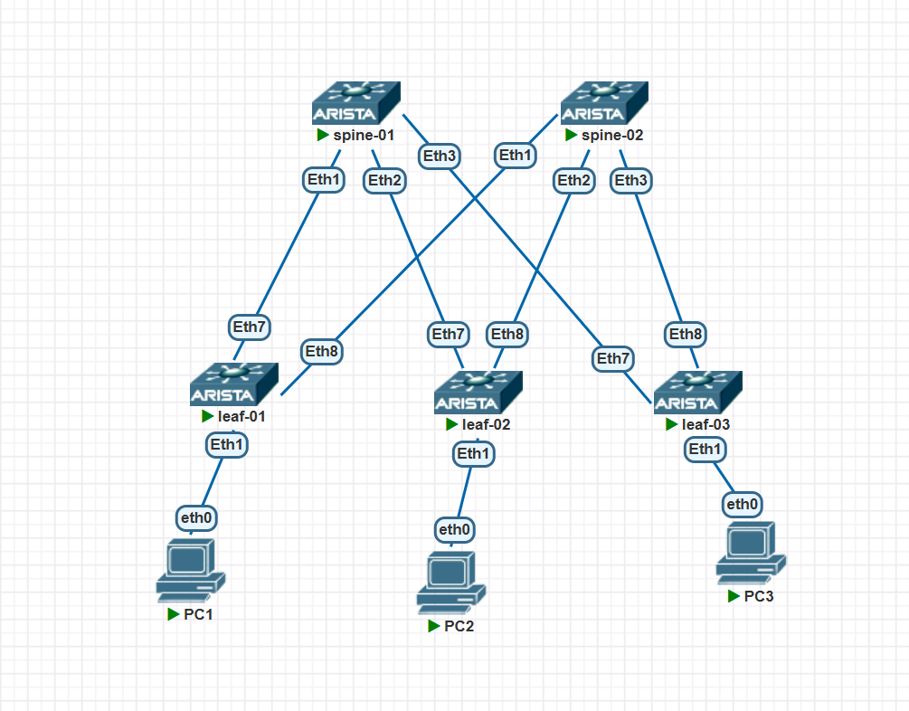

### VxLAN. L2 VNI

### Цели/Задачи
1) Настроить BGP peering между Leaf и Spine в AF l2vpn evpn
2) Настроить связанность между клиентами в первой зоне и убедитесь в её наличии
3) Зафиксировать в документации - план работы, адресное пространство, схему сети, конфигурацию устройств

### Реализация
Схема сети


### ip план

| Устройство | Интерфейс | IP-адрес       | Loopback IP    | Дескрипшен                       |
|------------|-----------|----------------|----------------|----------------------------------|
| leaf-01    | eth7      | 10.10.10.0/31  | 10.0.0.1/32    | spine-01_et1                     |
| leaf-01    | eth8      | 10.10.10.2/31  | 10.0.0.1/32    | spine-02_et1                     |
| leaf-02    | eth7      | 10.10.10.4/31  | 10.0.0.2/32    | spine-01_et2                     |
| leaf-02    | eth8      | 10.10.10.6/31  | 10.0.0.2/32    | spine-02_et2                     |
| leaf-03    | eth7      | 10.10.10.8/31  | 10.0.0.3/32    | spine-01_et3                     |
| leaf-03    | eth8      | 10.10.10.10/31 | 10.0.0.3/32    | spine-02_et3                     |
| spine-01   | eth1      | 10.10.10.1/31  | 10.0.0.4/32    | leaf-01_et7                      |
| spine-01   | eth2      | 10.10.10.5/31  | 10.0.0.4/32    | leaf-02_et7                      |
| spine-01   | eth3      | 10.10.10.9/31  | 10.0.0.4/32    | leaf-03_et7                      |
| spine-02   | eth1      | 10.10.10.3/31  | 10.0.0.5/32    | leaf-01_et8                      |
| spine-02   | eth2      | 10.10.10.7/31  | 10.0.0.5/32    | leaf-02_et8                      |
| spine-02   | eth3      | 10.10.10.11/31 | 10.0.0.5/32    | leaf-03_et8                      |


### Конфигурации
<details>
<summary><b>leaf-01</b> (нажмите, чтобы раскрыть)</summary>

```cisco
! Command: show running-config
! device: leaf-01 (vEOS-lab, EOS-4.33.1F)
!
! boot system flash:/vEOS-lab.swi
!
no aaa root
!
no service interface inactive port-id allocation disabled
!
transceiver qsfp default-mode 4x10G
!
service routing protocols model multi-agent
!
hostname leaf-01
!
spanning-tree mode mstp
!
system l1
   unsupported speed action error
   unsupported error-correction action error
!
vlan 10
!
interface Ethernet1
   switchport access vlan 10
   descriptionn PC1
!
interface Ethernet2
!
interface Ethernet3
!
interface Ethernet4
!
interface Ethernet5
!
interface Ethernet6
!
interface Ethernet7
   description spine-01_et01
   no switchport
   ip address 10.10.10.0/31
!
interface Ethernet8
   description spine-02_et01
   no switchport
   ip address 10.10.10.2/31
!
interface Loopback0
   ip address 10.0.0.1/32
!
interface Management1
!
interface Vxlan1
   vxlan source-interface Loopback0
   vxlan udp-port 4789
   vxlan vlan 10 vni 10010
!
ip routing
!
route-map RM_RED_Lo permit 10
   set origin igp
!
router bgp 65000
   router-id 10.0.0.1
   maximum-paths 4 ecmp 4
   neighbor SPINES peer group
   neighbor SPINES remote-as 65000
   neighbor SPINES bfd
   neighbor SPINES route-reflector-client
   neighbor SPINES timers 3 9
   neighbor SPINES send-community extended
   neighbor 10.10.10.1 peer group SPINES
   neighbor 10.10.10.1 description spine-01
   neighbor 10.10.10.3 peer group SPINES
   neighbor 10.10.10.3 description spine-02
   !
   vlan 10
      rd auto
      route-target export auto 65000
      route-target import auto 65000
      redistribute learned
   !
   address-family evpn
      neighbor SPINES activate
   !
   address-family ipv4
      neighbor SPINES activate
      redistribute connected route-map RM_RED_Lo
!
router multicast
   ipv4
      software-forwarding kernel
   !
   ipv6
      software-forwarding kernel
!
end
```

</details>

<details>
<summary><b>leaf-02</b> (нажмите, чтобы раскрыть)</summary>

```cisco
! Command: show running-config
! device: leaf-02 (vEOS-lab, EOS-4.33.1F)
!
! boot system flash:/vEOS-lab.swi
!
no aaa root
!
no service interface inactive port-id allocation disabled
!
transceiver qsfp default-mode 4x10G
!
service routing protocols model multi-agent
!
hostname leaf-02
!
spanning-tree mode mstp
!
system l1
   unsupported speed action error
   unsupported error-correction action error
!
vlan 10
!
interface Ethernet1
   switchport access vlan 10
!
interface Ethernet2
!
interface Ethernet3
!
interface Ethernet4
!
interface Ethernet5
!
interface Ethernet6
!
interface Ethernet7
   description spine-01_et02
   no switchport
   ip address 10.10.10.4/31
!
interface Ethernet8
   description spine-02_et02
   no switchport
   ip address 10.10.10.6/31
!
interface Loopback0
   ip address 10.0.0.2/32
!
interface Management1
!
interface Vxlan1
   vxlan source-interface Loopback0
   vxlan udp-port 4789
   vxlan vlan 10 vni 10010
!
ip routing
!
route-map RM_RED_Lo permit 10
   set origin igp
!
router bgp 65000
   router-id 10.0.0.2
   maximum-paths 4 ecmp 4
   neighbor SPINES peer group
   neighbor SPINES remote-as 65000
   neighbor SPINES bfd
   neighbor SPINES route-reflector-client
   neighbor SPINES timers 3 9
   neighbor SPINES send-community extended
   neighbor 10.10.10.5 peer group SPINES
   neighbor 10.10.10.5 description spine-01
   neighbor 10.10.10.7 peer group SPINES
   neighbor 10.10.10.7 description spine-02
   !
   vlan 10
      rd auto
      route-target export auto 65000
      route-target import auto 65000
      redistribute learned
   !
   address-family evpn
      neighbor SPINES activate
   !
   address-family ipv4
      neighbor SPINES activate
      redistribute connected route-map RM_RED_Lo
!
router multicast
   ipv4
      software-forwarding kernel
   !
   ipv6
      software-forwarding kernel
!
end
```

</details>

<details>
<summary><b>leaf-03</b> (нажмите, чтобы раскрыть)</summary>

```cisco
! Command: show running-config
! device: leaf-03 (vEOS-lab, EOS-4.33.1F)
!
! boot system flash:/vEOS-lab.swi
!
no aaa root
!
no service interface inactive port-id allocation disabled
!
transceiver qsfp default-mode 4x10G
!
service routing protocols model multi-agent
!
hostname leaf-03
!
spanning-tree mode mstp
!
system l1
   unsupported speed action error
   unsupported error-correction action error
!
vlan 10
!
interface Ethernet1
   switchport access vlan 10
!
interface Ethernet2
!
interface Ethernet3
!
interface Ethernet4
!
interface Ethernet5
!
interface Ethernet6
!
interface Ethernet7
   description spine-01_et03
   no switchport
   ip address 10.10.10.8/31
!
interface Ethernet8
   description spine-02_et03
   no switchport
   ip address 10.10.10.10/31
!
interface Loopback0
   ip address 10.0.0.3/32
!
interface Management1
!
interface Vxlan1
   vxlan source-interface Loopback0
   vxlan udp-port 4789
   vxlan vlan 10 vni 10010
!
ip routing
!
route-map RM_RED_Lo permit 10
   set origin igp
!
router bgp 65000
   router-id 10.0.0.3
   maximum-paths 4 ecmp 4
   neighbor SPINES peer group
   neighbor SPINES remote-as 65000
   neighbor SPINES bfd
   neighbor SPINES route-reflector-client
   neighbor SPINES timers 3 9
   neighbor SPINES send-community extended
   neighbor 10.10.10.9 peer group SPINES
   neighbor 10.10.10.9 description spine-01
   neighbor 10.10.10.11 peer group SPINES
   neighbor 10.10.10.11 description spine-02
   !
   vlan 10
      rd auto
      route-target export auto 65000
      route-target import auto 65000
      redistribute learned
   !
   address-family evpn
      neighbor SPINES activate
   !
   address-family ipv4
      neighbor SPINES activate
      redistribute connected route-map RM_RED_Lo
!
router multicast
   ipv4
      software-forwarding kernel
   !
   ipv6
      software-forwarding kernel
!
end
```

</details>

<details>
<summary><b>spine-01</b> (нажмите, чтобы раскрыть)</summary>

```cisco
! Command: show running-config
! device: spine-01 (vEOS-lab, EOS-4.33.1F)
!
! boot system flash:/vEOS-lab.swi
!
no aaa root
!
no service interface inactive port-id allocation disabled
!
transceiver qsfp default-mode 4x10G
!
service routing protocols model multi-agent
!
hostname spine-01
!
spanning-tree mode mstp
!
system l1
   unsupported speed action error
   unsupported error-correction action error
!
interface Ethernet1
   description leaf-01_et7
   no switchport
   ip address 10.10.10.1/31
!
interface Ethernet2
   description leaf-02_et7
   no switchport
   ip address 10.10.10.5/31
!
interface Ethernet3
   description leaf-03_et7
   no switchport
   ip address 10.10.10.9/31
!
interface Ethernet4
!
interface Ethernet5
!
interface Ethernet6
!
interface Ethernet7
!
interface Ethernet8
!
interface Loopback0
   ip address 10.0.0.4/32
!
interface Management1
!
ip routing
!
route-map RM_RED_Lo permit 10
   set origin igp
!
router bgp 65000
   router-id 10.0.0.4
   maximum-paths 4 ecmp 4
   neighbor LEAFS peer group
   neighbor LEAFS remote-as 65000
   neighbor LEAFS bfd
   neighbor LEAFS route-reflector-client
   neighbor LEAFS timers 3 9
   neighbor LEAFS send-community extended
   neighbor 10.10.10.0 peer group LEAFS
   neighbor 10.10.10.0 description leaf-01
   neighbor 10.10.10.4 peer group LEAFS
   neighbor 10.10.10.4 description leaf-02
   neighbor 10.10.10.8 peer group LEAFS
   neighbor 10.10.10.8 description leaf-03
   !
   address-family evpn
      neighbor LEAFS activate
   !
   address-family ipv4
      neighbor LEAFS activate
      neighbor LEAFS next-hop-self
      redistribute connected route-map RM_RED_Lo
!
router multicast
   ipv4
      software-forwarding kernel
   !
   ipv6
      software-forwarding kernel
!
end
```

</details>

<details>
<summary><b>spine-02</b> (нажмите, чтобы раскрыть)</summary>

```cisco
! Command: show running-config
! device: spine-02 (vEOS-lab, EOS-4.33.1F)
!
! boot system flash:/vEOS-lab.swi
!
no aaa root
!
no service interface inactive port-id allocation disabled
!
transceiver qsfp default-mode 4x10G
!
service routing protocols model multi-agent
!
hostname spine-02
!
spanning-tree mode mstp
!
system l1
   unsupported speed action error
   unsupported error-correction action error
!
interface Ethernet1
   description leaf-01_et8
   no switchport
   ip address 10.10.10.3/31
!
interface Ethernet2
   description leaf-02_et8
   no switchport
   ip address 10.10.10.7/31
!
interface Ethernet3
   description leaf-03_et8
   no switchport
   ip address 10.10.10.11/31
!
interface Ethernet4
!
interface Ethernet5
!
interface Ethernet6
!
interface Ethernet7
!
interface Ethernet8
!
interface Loopback0
   ip address 10.0.0.5/32
!
interface Management1
!
ip routing
!
route-map RM_RED_Lo permit 10
   set origin incomplete
!
router bgp 65000
   router-id 10.0.0.5
   maximum-paths 4 ecmp 4
   neighbor LEAFS peer group
   neighbor LEAFS remote-as 65000
   neighbor LEAFS bfd
   neighbor LEAFS route-reflector-client
   neighbor LEAFS timers 3 9
   neighbor LEAFS send-community extended
   neighbor 10.10.10.2 peer group LEAFS
   neighbor 10.10.10.2 description leaf-01
   neighbor 10.10.10.6 peer group LEAFS
   neighbor 10.10.10.6 description leaf-02
   neighbor 10.10.10.10 peer group LEAFS
   neighbor 10.10.10.10 description leaf-03
   !
   address-family evpn
      neighbor LEAFS activate
   !
   address-family ipv4
      neighbor LEAFS activate
      neighbor LEAFS next-hop-self
      redistribute connected route-map RM_RED_Lo
!
router multicast
   ipv4
      software-forwarding kernel
   !
   ipv6
      software-forwarding kernel
!
end
```

</details>

### Проверка соседства/распространения маршрутов
```cisco
leaf-01#show bgp evpn summary
BGP summary information for VRF default
Router identifier 10.0.0.1, local AS number 65000
Neighbor Status Codes: m - Under maintenance
  Description              Neighbor   V AS           MsgRcvd   MsgSent  InQ OutQ  Up/Down State   PfxRcd PfxAcc
  spine-01                 10.10.10.1 4 65000           2994      2996    0    0 01:40:27 Estab   4      4
  spine-02                 10.10.10.3 4 65000           2990      3001    0    0 01:40:28 Estab   4      4
leaf-01#show bgp evpn route-type mac-ip
BGP routing table information for VRF default
Router identifier 10.0.0.1, local AS number 65000
Route status codes: * - valid, > - active, S - Stale, E - ECMP head, e - ECMP
                    c - Contributing to ECMP, % - Pending best path selection
Origin codes: i - IGP, e - EGP, ? - incomplete
AS Path Attributes: Or-ID - Originator ID, C-LST - Cluster List, LL Nexthop - Link Local Nexthop

          Network                Next Hop              Metric  LocPref Weight  Path
 * >      RD: 10.0.0.1:10 mac-ip 0050.7966.6806
                                 -                     -       -       0       i
 * >Ec    RD: 10.0.0.2:10 mac-ip 0050.7966.6807
                                 10.0.0.2              -       100     0       i Or-ID: 10.0.0.2 C-LST: 10.0.0.4
 *  ec    RD: 10.0.0.2:10 mac-ip 0050.7966.6807
                                 10.0.0.2              -       100     0       i Or-ID: 10.0.0.2 C-LST: 10.0.0.5
 * >Ec    RD: 10.0.0.3:10 mac-ip 0050.7966.6808
                                 10.0.0.3              -       100     0       i Or-ID: 10.0.0.3 C-LST: 10.0.0.4
 *  ec    RD: 10.0.0.3:10 mac-ip 0050.7966.6808
                                 10.0.0.3              -       100     0       i Or-ID: 10.0.0.3 C-LST: 10.0.0.5
leaf-01#sh mac ad
          Mac Address Table
------------------------------------------------------------------

Vlan    Mac Address       Type        Ports      Moves   Last Move
----    -----------       ----        -----      -----   ---------
  10    0050.7966.6806    DYNAMIC     Et1        1       0:00:52 ago
  10    0050.7966.6807    DYNAMIC     Vx1        1       0:00:52 ago
  10    0050.7966.6808    DYNAMIC     Vx1        1       0:00:44 ago
Total Mac Addresses for this criterion: 3

          Multicast Mac Address Table
------------------------------------------------------------------

Vlan    Mac Address       Type        Ports
----    -----------       ----        -----
Total Mac Addresses for this criterion: 0
