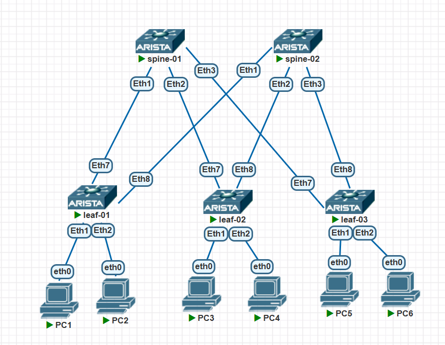

### VxLAN. L3VNI

### Цели/Задачи
1) Настроить каждого клиента в своем VNI
2) Настроить маршрутизацию между клиентами.
3) Зафиксировать в документации - план работы, адресное пространство, схему сети, конфигурацию устройств

### Реализация
Схема сети


### ip план

| Устройство | Интерфейс | IP-адрес       | Loopback IP    | Дескрипшен                       |
|------------|-----------|----------------|----------------|----------------------------------|
| leaf-01    | eth7      | 10.10.10.0/31  | 10.0.0.1/32    | spine-01_et1                     |
| leaf-01    | eth8      | 10.10.10.2/31  | 10.0.0.1/32    | spine-02_et1                     |
| leaf-02    | eth7      | 10.10.10.4/31  | 10.0.0.2/32    | spine-01_et2                     |
| leaf-02    | eth8      | 10.10.10.6/31  | 10.0.0.2/32    | spine-02_et2                     |
| leaf-03    | eth7      | 10.10.10.8/31  | 10.0.0.3/32    | spine-01_et3                     |
| leaf-03    | eth8      | 10.10.10.10/31 | 10.0.0.3/32    | spine-02_et3                     |
| spine-01   | eth1      | 10.10.10.1/31  | 10.0.0.4/32    | leaf-01_et7                      |
| spine-01   | eth2      | 10.10.10.5/31  | 10.0.0.4/32    | leaf-02_et7                      |
| spine-01   | eth3      | 10.10.10.9/31  | 10.0.0.4/32    | leaf-03_et7                      |
| spine-02   | eth1      | 10.10.10.3/31  | 10.0.0.5/32    | leaf-01_et8                      |
| spine-02   | eth2      | 10.10.10.7/31  | 10.0.0.5/32    | leaf-02_et8                      |
| spine-02   | eth3      | 10.10.10.11/31 | 10.0.0.5/32    | leaf-03_et8                      |
| PC1        | eth0      | 192.168.10.2/24| -              |                                  |
| PC2        | eth0      | 192.168.20.2/24| -              |                                  |
| PC3        | eth0      | 192.168.10.3/24| -              |                                  |
| PC4        | eth0      | 192.168.20.3/24| -              |                                  |
| PC5        | eth0      | 192.168.10.4/24| -              |                                  |
| PC6        | eth0      | 192.168.20.4/24| -              |                                  |
| leaf-01-03 | vlan10    | 192.168.10.1/24| -              | anycast gw                       |
| leaf-01-03 | vlan20    | 192.168.20.4/24| -              | anycast gw                       |


### Конфигурации
<details>
<summary><b>leaf-01</b> (нажмите, чтобы раскрыть)</summary>

```cisco
! Command: show running-config
! device: leaf-01 (vEOS-lab, EOS-4.33.1F)
!
! boot system flash:/vEOS-lab.swi
!
no aaa root
!
no service interface inactive port-id allocation disabled
!
transceiver qsfp default-mode 4x10G
!
service routing protocols model multi-agent
!
hostname leaf-01
!
spanning-tree mode mstp
!
system l1
   unsupported speed action error
   unsupported error-correction action error
!
vlan 10,20
!
vrf instance ten-1
!
interface Ethernet1
   switchport access vlan 10
!
interface Ethernet2
   switchport access vlan 20
!
interface Ethernet3
!
interface Ethernet4
!
interface Ethernet5
!
interface Ethernet6
!
interface Ethernet7
   description spine-01_et01
   no switchport
   ip address 10.10.10.0/31
   ip ospf network point-to-point
   ip ospf area 0.0.0.0
!
interface Ethernet8
   description spine-02_et01
   no switchport
   ip address 10.10.10.2/31
   ip ospf network point-to-point
   ip ospf area 0.0.0.0
!
interface Loopback0
   ip address 10.0.0.1/32
   ip ospf area 0.0.0.0
!
interface Management1
!
interface Vlan10
   vrf ten-1
   ip address virtual 192.168.10.1/24
!
interface Vlan20
   vrf ten-1
   ip address virtual 192.168.20.1/24
!
interface Vxlan1
   vxlan source-interface Loopback0
   vxlan udp-port 4789
   vxlan vlan 10 vni 10010
   vxlan vlan 20 vni 10020
   vxlan vrf ten-1 vni 10100
!
ip virtual-router mac-address 00:00:00:00:00:01
!
ip routing
ip routing vrf ten-1
!
route-map RM_RED_Lo permit 10
   set origin igp
!
router bgp 65000
   router-id 10.0.0.1
   maximum-paths 4 ecmp 4
   neighbor SPINES peer group
   neighbor SPINES remote-as 65000
   neighbor SPINES bfd
   neighbor SPINES route-reflector-client
   neighbor SPINES timers 3 9
   neighbor SPINES send-community extended
   neighbor 10.10.10.1 peer group SPINES
   neighbor 10.10.10.1 description spine-01
   neighbor 10.10.10.3 peer group SPINES
   neighbor 10.10.10.3 description spine-02
   redistribute connected
   !
   vlan 10
      rd auto
      route-target both 65000:10010
      redistribute learned
   !
   vlan 20
      rd auto
      route-target both 65000:10020
      redistribute learned
   !
   address-family evpn
      neighbor SPINES activate
   !
   vrf ten-1
      rd 65000:10102
      route-target import evpn 65000:10100
      route-target export evpn 65000:10100
      redistribute connected
!
router multicast
   ipv4
      software-forwarding kernel
   !
   ipv6
      software-forwarding kernel
!
router ospf 1
   router-id 10.0.0.1
   bfd default
   max-lsa 12000
!
end
```

</details>

<details>
<summary><b>leaf-02</b> (нажмите, чтобы раскрыть)</summary>

```cisco
! Command: show running-config
! device: leaf-02 (vEOS-lab, EOS-4.33.1F)
!
! boot system flash:/vEOS-lab.swi
!
no aaa root
!
no service interface inactive port-id allocation disabled
!
transceiver qsfp default-mode 4x10G
!
service routing protocols model multi-agent
!
hostname leaf-02
!
spanning-tree mode mstp
!
system l1
   unsupported speed action error
   unsupported error-correction action error
!
vlan 10,20
!
vrf instance ten-1
!
interface Ethernet1
   switchport access vlan 10
!
interface Ethernet2
   switchport access vlan 20
!
interface Ethernet3
!
interface Ethernet4
!
interface Ethernet5
!
interface Ethernet6
!
interface Ethernet7
   description spine-01_et02
   no switchport
   ip address 10.10.10.4/31
   ip ospf network point-to-point
   ip ospf area 0.0.0.0
!
interface Ethernet8
   description spine-02_et02
   no switchport
   ip address 10.10.10.6/31
   ip ospf network point-to-point
   ip ospf area 0.0.0.0
!
interface Loopback0
   ip address 10.0.0.2/32
   ip ospf area 0.0.0.0
!
interface Management1
!
interface Vlan10
   vrf ten-1
   ip address virtual 192.168.10.1/24
!
interface Vlan20
   vrf ten-1
   ip address virtual 192.168.20.1/24
!
interface Vxlan1
   vxlan source-interface Loopback0
   vxlan udp-port 4789
   vxlan vlan 10 vni 10010
   vxlan vlan 20 vni 10020
   vxlan vrf ten-1 vni 10100
!
ip virtual-router mac-address 00:00:00:00:00:01
!
ip routing
ip routing vrf ten-1
!
route-map RM_RED_Lo permit 10
   set origin igp
!
router bgp 65000
   router-id 10.0.0.2
   maximum-paths 4 ecmp 4
   neighbor SPINES peer group
   neighbor SPINES remote-as 65000
   neighbor SPINES bfd
   neighbor SPINES route-reflector-client
   neighbor SPINES timers 3 9
   neighbor SPINES send-community extended
   neighbor 10.10.10.5 peer group SPINES
   neighbor 10.10.10.5 description spine-01
   neighbor 10.10.10.7 peer group SPINES
   neighbor 10.10.10.7 description spine-02
   !
   vlan 10
      rd auto
      route-target both 65000:10010
      redistribute learned
   !
   vlan 20
      rd auto
      route-target both 65000:10020
      redistribute learned
   !
   address-family evpn
      neighbor SPINES activate
   !
   vrf ten-1
      rd 65000:10102
      route-target import evpn 65000:10100
      route-target export evpn 65000:10100
      redistribute connected
!
router multicast
   ipv4
      software-forwarding kernel
   !
   ipv6
      software-forwarding kernel
!
router ospf 1
   router-id 10.0.0.2
   bfd default
   max-lsa 12000
!
end
```

</details>

<details>
<summary><b>leaf-03</b> (нажмите, чтобы раскрыть)</summary>

```cisco
! Command: show running-config
! device: leaf-03 (vEOS-lab, EOS-4.33.1F)
!
! boot system flash:/vEOS-lab.swi
!
no aaa root
!
no service interface inactive port-id allocation disabled
!
transceiver qsfp default-mode 4x10G
!
service routing protocols model multi-agent
!
hostname leaf-03
!
spanning-tree mode mstp
!
system l1
   unsupported speed action error
   unsupported error-correction action error
!
vlan 10,20
!
vrf instance ten-1
!
interface Ethernet1
   switchport access vlan 10
!
interface Ethernet2
   switchport access vlan 20
!
interface Ethernet3
!
interface Ethernet4
!
interface Ethernet5
!
interface Ethernet6
!
interface Ethernet7
   description spine-01_et03
   no switchport
   ip address 10.10.10.8/31
   ip ospf network point-to-point
   ip ospf area 0.0.0.0
!
interface Ethernet8
   description spine-02_et03
   no switchport
   ip address 10.10.10.10/31
   ip ospf network point-to-point
   ip ospf area 0.0.0.0
!
interface Loopback0
   ip address 10.0.0.3/32
   ip ospf area 0.0.0.0
!
interface Management1
!
interface Vlan10
   vrf ten-1
   ip address virtual 192.168.10.1/24
!
interface Vlan20
   vrf ten-1
   ip address virtual 192.168.20.1/24
!
interface Vxlan1
   vxlan source-interface Loopback0
   vxlan udp-port 4789
   vxlan vlan 10 vni 10010
   vxlan vlan 20 vni 10020
   vxlan vrf ten-1 vni 10100
!
ip virtual-router mac-address 00:00:00:00:00:01
!
ip routing
ip routing vrf ten-1
!
route-map RM_RED_Lo permit 10
   set origin igp
!
router bgp 65000
   router-id 10.0.0.3
   maximum-paths 4 ecmp 4
   neighbor SPINES peer group
   neighbor SPINES remote-as 65000
   neighbor SPINES bfd
   neighbor SPINES route-reflector-client
   neighbor SPINES timers 3 9
   neighbor SPINES send-community extended
   neighbor 10.10.10.9 peer group SPINES
   neighbor 10.10.10.9 description spine-01
   neighbor 10.10.10.11 peer group SPINES
   neighbor 10.10.10.11 description spine-02
   !
   vlan 10
      rd auto
      route-target both 65000:10010
      redistribute learned
   !
   vlan 20
      rd auto
      route-target both 65000:10020
      redistribute learned
   !
   address-family evpn
      neighbor SPINES activate
   !
   vrf ten-1
      rd 65000:10102
      route-target import evpn 65000:10100
      route-target export evpn 65000:10100
      redistribute connected
!
router multicast
   ipv4
      software-forwarding kernel
   !
   ipv6
      software-forwarding kernel
!
router ospf 1
   router-id 10.0.0.3
   bfd default
   max-lsa 12000
!
end
```

</details>

<details>
<summary><b>spine-01</b> (нажмите, чтобы раскрыть)</summary>

```cisco
! Command: show running-config
! device: spine-01 (vEOS-lab, EOS-4.33.1F)
!
! boot system flash:/vEOS-lab.swi
!
no aaa root
!
no service interface inactive port-id allocation disabled
!
transceiver qsfp default-mode 4x10G
!
service routing protocols model multi-agent
!
hostname spine-01
!
spanning-tree mode mstp
!
system l1
   unsupported speed action error
   unsupported error-correction action error
!
interface Ethernet1
   description leaf-01_et7
   no switchport
   ip address 10.10.10.1/31
   ip ospf network point-to-point
   ip ospf area 0.0.0.0
!
interface Ethernet2
   description leaf-02_et7
   no switchport
   ip address 10.10.10.5/31
   ip ospf network point-to-point
   ip ospf area 0.0.0.0
!
interface Ethernet3
   description leaf-03_et7
   no switchport
   ip address 10.10.10.9/31
   ip ospf network point-to-point
   ip ospf area 0.0.0.0
!
interface Ethernet4
!
interface Ethernet5
!
interface Ethernet6
!
interface Ethernet7
!
interface Ethernet8
!
interface Loopback0
   ip address 10.0.0.4/32
!
interface Management1
!
ip routing
!
route-map RM_RED_Lo permit 10
   set origin igp
!
router bgp 65000
   router-id 10.0.0.4
   maximum-paths 4 ecmp 4
   neighbor LEAFS peer group
   neighbor LEAFS remote-as 65000
   neighbor LEAFS bfd
   neighbor LEAFS route-reflector-client
   neighbor LEAFS timers 3 9
   neighbor LEAFS send-community extended
   neighbor 10.10.10.0 peer group LEAFS
   neighbor 10.10.10.0 description leaf-01
   neighbor 10.10.10.4 peer group LEAFS
   neighbor 10.10.10.4 description leaf-02
   neighbor 10.10.10.8 peer group LEAFS
   neighbor 10.10.10.8 description leaf-03
   !
   address-family evpn
      neighbor LEAFS activate
!
router multicast
   ipv4
      software-forwarding kernel
   !
   ipv6
      software-forwarding kernel
!
router ospf 1
   router-id 10.0.0.4
   bfd default
   max-lsa 12000
!
end
```

</details>

<details>
<summary><b>spine-02</b> (нажмите, чтобы раскрыть)</summary>

```cisco
! Command: show running-config
! device: spine-02 (vEOS-lab, EOS-4.33.1F)
!
! boot system flash:/vEOS-lab.swi
!
no aaa root
!
no service interface inactive port-id allocation disabled
!
transceiver qsfp default-mode 4x10G
!
service routing protocols model multi-agent
!
hostname spine-02
!
spanning-tree mode mstp
!
system l1
   unsupported speed action error
   unsupported error-correction action error
!
interface Ethernet1
   description leaf-01_et8
   no switchport
   ip address 10.10.10.3/31
   ip ospf network point-to-point
   ip ospf area 0.0.0.0
!
interface Ethernet2
   description leaf-02_et8
   no switchport
   ip address 10.10.10.7/31
   ip ospf network point-to-point
   ip ospf area 0.0.0.0
!
interface Ethernet3
   description leaf-03_et8
   no switchport
   ip address 10.10.10.11/31
   ip ospf network point-to-point
   ip ospf area 0.0.0.0
!
interface Ethernet4
!
interface Ethernet5
!
interface Ethernet6
!
interface Ethernet7
!
interface Ethernet8
!
interface Loopback0
   ip address 10.0.0.5/32
!
interface Management1
!
ip routing
!
route-map RM_RED_Lo permit 10
   set origin incomplete
!
router bgp 65000
   router-id 10.0.0.5
   maximum-paths 4 ecmp 4
   neighbor LEAFS peer group
   neighbor LEAFS remote-as 65000
   neighbor LEAFS bfd
   neighbor LEAFS route-reflector-client
   neighbor LEAFS timers 3 9
   neighbor LEAFS send-community extended
   neighbor 10.10.10.2 peer group LEAFS
   neighbor 10.10.10.2 description leaf-01
   neighbor 10.10.10.6 peer group LEAFS
   neighbor 10.10.10.6 description leaf-02
   neighbor 10.10.10.10 peer group LEAFS
   neighbor 10.10.10.10 description leaf-03
   !
   address-family evpn
      neighbor LEAFS activate
!
router multicast
   ipv4
      software-forwarding kernel
   !
   ipv6
      software-forwarding kernel
!
router ospf 1
   router-id 10.0.0.5
   bfd default
   max-lsa 12000
!
end
```

</details>

### Проверка соседства/распространения маршрутов
```cisco
leaf-01#sh mac ad
          Mac Address Table
------------------------------------------------------------------

Vlan    Mac Address       Type        Ports      Moves   Last Move
----    -----------       ----        -----      -----   ---------
  10    0000.0000.0001    STATIC      Cpu
  10    0050.7966.6806    DYNAMIC     Et1        1       0:16:19 ago
  10    0050.7966.6807    DYNAMIC     Vx1        1       0:03:12 ago
  10    0050.7966.6808    DYNAMIC     Vx1        1       0:03:10 ago
  20    0000.0000.0001    STATIC      Cpu
  20    0050.7966.6809    DYNAMIC     Et2        1       0:06:21 ago
  20    0050.7966.680a    DYNAMIC     Vx1        1       0:06:24 ago
  20    0050.7966.680b    DYNAMIC     Vx1        1       0:06:27 ago
Total Mac Addresses for this criterion: 8

          Multicast Mac Address Table
------------------------------------------------------------------

Vlan    Mac Address       Type        Ports
----    -----------       ----        -----
Total Mac Addresses for this criterion: 0

leaf-01#sh bgp evpn route-type mac-ip
BGP routing table information for VRF default
Router identifier 10.0.0.1, local AS number 65000
Route status codes: * - valid, > - active, S - Stale, E - ECMP head, e - ECMP
                    c - Contributing to ECMP, % - Pending best path selection
Origin codes: i - IGP, e - EGP, ? - incomplete
AS Path Attributes: Or-ID - Originator ID, C-LST - Cluster List, LL Nexthop - Link Local Nexthop

          Network                Next Hop              Metric  LocPref Weight  Path
 * >      RD: 10.0.0.1:10 mac-ip 0050.7966.6806
                                 -                     -       -       0       i
 * >      RD: 10.0.0.1:10 mac-ip 0050.7966.6806 192.168.10.2
                                 -                     -       -       0       i
 * >Ec    RD: 10.0.0.2:10 mac-ip 0050.7966.6807
                                 10.0.0.2              -       100     0       i Or-ID: 10.0.0.2 C-LST: 10.0.0.4
 *  ec    RD: 10.0.0.2:10 mac-ip 0050.7966.6807
                                 10.0.0.2              -       100     0       i Or-ID: 10.0.0.2 C-LST: 10.0.0.5
 * >Ec    RD: 10.0.0.2:10 mac-ip 0050.7966.6807 192.168.10.3
                                 10.0.0.2              -       100     0       i Or-ID: 10.0.0.2 C-LST: 10.0.0.4
 *  ec    RD: 10.0.0.2:10 mac-ip 0050.7966.6807 192.168.10.3
                                 10.0.0.2              -       100     0       i Or-ID: 10.0.0.2 C-LST: 10.0.0.5
 * >Ec    RD: 10.0.0.3:10 mac-ip 0050.7966.6808
                                 10.0.0.3              -       100     0       i Or-ID: 10.0.0.3 C-LST: 10.0.0.5
 *  ec    RD: 10.0.0.3:10 mac-ip 0050.7966.6808
                                 10.0.0.3              -       100     0       i Or-ID: 10.0.0.3 C-LST: 10.0.0.4
 * >Ec    RD: 10.0.0.3:10 mac-ip 0050.7966.6808 192.168.10.4
                                 10.0.0.3              -       100     0       i Or-ID: 10.0.0.3 C-LST: 10.0.0.5
 *  ec    RD: 10.0.0.3:10 mac-ip 0050.7966.6808 192.168.10.4
                                 10.0.0.3              -       100     0       i Or-ID: 10.0.0.3 C-LST: 10.0.0.4
 * >      RD: 10.0.0.1:20 mac-ip 0050.7966.6809
                                 -                     -       -       0       i
 * >      RD: 10.0.0.1:20 mac-ip 0050.7966.6809 192.168.20.2
                                 -                     -       -       0       i
 * >Ec    RD: 10.0.0.2:20 mac-ip 0050.7966.680a
                                 10.0.0.2              -       100     0       i Or-ID: 10.0.0.2 C-LST: 10.0.0.5
 *  ec    RD: 10.0.0.2:20 mac-ip 0050.7966.680a
                                 10.0.0.2              -       100     0       i Or-ID: 10.0.0.2 C-LST: 10.0.0.4
 * >Ec    RD: 10.0.0.2:20 mac-ip 0050.7966.680a 192.168.20.3
                                 10.0.0.2              -       100     0       i Or-ID: 10.0.0.2 C-LST: 10.0.0.5
 *  ec    RD: 10.0.0.2:20 mac-ip 0050.7966.680a 192.168.20.3
                                 10.0.0.2              -       100     0       i Or-ID: 10.0.0.2 C-LST: 10.0.0.4
 * >Ec    RD: 10.0.0.3:20 mac-ip 0050.7966.680b
                                 10.0.0.3              -       100     0       i Or-ID: 10.0.0.3 C-LST: 10.0.0.4
 *  ec    RD: 10.0.0.3:20 mac-ip 0050.7966.680b
                                 10.0.0.3              -       100     0       i Or-ID: 10.0.0.3 C-LST: 10.0.0.5
 * >Ec    RD: 10.0.0.3:20 mac-ip 0050.7966.680b 192.168.20.4
                                 10.0.0.3              -       100     0       i Or-ID: 10.0.0.3 C-LST: 10.0.0.4
 *  ec    RD: 10.0.0.3:20 mac-ip 0050.7966.680b 192.168.20.4
                                 10.0.0.3              -       100     0       i Or-ID: 10.0.0.3 C-LST: 10.0.0.5

leaf-01#sh ip route vrf ten-1

VRF: ten-1
Source Codes:
       C - connected, S - static, K - kernel,
       O - OSPF, IA - OSPF inter area, E1 - OSPF external type 1,
       E2 - OSPF external type 2, N1 - OSPF NSSA external type 1,
       N2 - OSPF NSSA external type2, B - Other BGP Routes,
       B I - iBGP, B E - eBGP, R - RIP, I L1 - IS-IS level 1,
       I L2 - IS-IS level 2, O3 - OSPFv3, A B - BGP Aggregate,
       A O - OSPF Summary, NG - Nexthop Group Static Route,
       V - VXLAN Control Service, M - Martian,
       DH - DHCP client installed default route,
       DP - Dynamic Policy Route, L - VRF Leaked,
       G  - gRIBI, RC - Route Cache Route,
       CL - CBF Leaked Route

Gateway of last resort is not set

 B I      192.168.10.3/32 [200/0]
           via VTEP 10.0.0.2 VNI 10100 router-mac 50:b2:96:88:87:b6 local-interface Vxlan1
 B I      192.168.10.4/32 [200/0]
           via VTEP 10.0.0.3 VNI 10100 router-mac 50:86:32:c0:b0:33 local-interface Vxlan1
 C        192.168.10.0/24
           directly connected, Vlan10
 B I      192.168.20.3/32 [200/0]
           via VTEP 10.0.0.2 VNI 10100 router-mac 50:b2:96:88:87:b6 local-interface Vxlan1
 B I      192.168.20.4/32 [200/0]
           via VTEP 10.0.0.3 VNI 10100 router-mac 50:86:32:c0:b0:33 local-interface Vxlan1
 C        192.168.20.0/24
           directly connected, Vlan20
leaf-01#sh bgp evpn route-type mac-ip 192.168.10.4 detail
BGP routing table information for VRF default
Router identifier 10.0.0.1, local AS number 65000
BGP routing table entry for mac-ip 0050.7966.6808 192.168.10.4, Route Distinguisher: 10.0.0.3:10
 Paths: 2 available
  Local (Received from a RR-client)
    10.0.0.3 from 10.10.10.3 (10.0.0.5)
      Origin IGP, metric -, localpref 100, weight 0, tag 0, valid, internal, ECMP head, ECMP, best, ECMP contributor
      Originator: 10.0.0.3, Cluster list: 10.0.0.5
      Extended Community: Route-Target-AS:65000:10010 Route-Target-AS:65000:10100 TunnelEncap:tunnelTypeVxlan EvpnRouterMac:50:86:32:c0:b0:33
      VNI: 10010 L3 VNI: 10100 ESI: 0000:0000:0000:0000:0000
  Local (Received from a RR-client)
    10.0.0.3 from 10.10.10.1 (10.0.0.4)
      Origin IGP, metric -, localpref 100, weight 0, tag 0, valid, internal, ECMP, ECMP contributor
      Originator: 10.0.0.3, Cluster list: 10.0.0.4
      Extended Community: Route-Target-AS:65000:10010 Route-Target-AS:65000:10100 TunnelEncap:tunnelTypeVxlan EvpnRouterMac:50:86:32:c0:b0:33
      VNI: 10010 L3 VNI: 10100 ESI: 0000:0000:0000:0000:0000

Пинг с PC1
VPCS> ping 192.168.10.3

84 bytes from 192.168.10.3 icmp_seq=1 ttl=64 time=4.375 ms
84 bytes from 192.168.10.3 icmp_seq=2 ttl=64 time=3.156 ms
^C
VPCS> ping 192.168.10.4

84 bytes from 192.168.10.4 icmp_seq=1 ttl=64 time=3.428 ms
84 bytes from 192.168.10.4 icmp_seq=2 ttl=64 time=3.609 ms
^C
VPCS> ping 192.168.20.2

84 bytes from 192.168.20.2 icmp_seq=1 ttl=63 time=14.231 ms
84 bytes from 192.168.20.2 icmp_seq=2 ttl=63 time=0.965 ms
^C
VPCS> ping 192.168.20.3
84 bytes from 192.168.20.3 icmp_seq=1 ttl=62 time=11.321 ms
84 bytes from 192.168.20.3 icmp_seq=2 ttl=62 time=3.233 ms
^C
VPCS> ping 192.168.20.4

84 bytes from 192.168.20.4 icmp_seq=1 ttl=62 time=4.749 ms
84 bytes from 192.168.20.4 icmp_seq=2 ttl=62 time=17.650 ms
^C
VPCS> 
