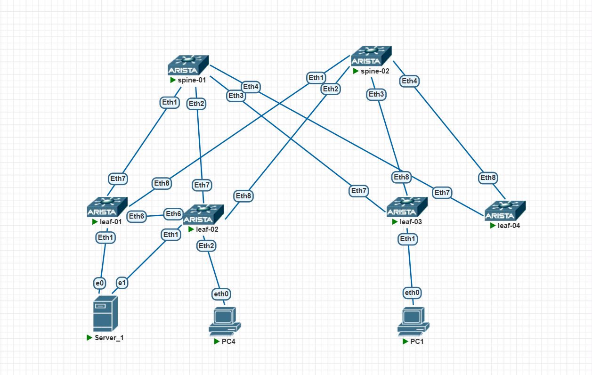

### VXLAN. Multihoming

### Цели/Задачи
1) Настроить каждого клиента в своем VNI
2) Настроить маршрутизацию между клиентами.
3) Зафиксировать в документации - план работы, адресное пространство, схему сети, конфигурацию устройств

### Реализация
Схема сети


### ip план

| Устройство | Интерфейс | IP-адрес       | Loopback IP    | Дескрипшен                       |
|------------|-----------|----------------|----------------|----------------------------------|
| leaf-01    | eth7      | 10.10.10.0/31  | 10.0.0.1/32    | spine-01_et1                     |
| leaf-01    | eth8      | 10.10.10.2/31  | 10.0.0.1/32    | spine-02_et1                     |
| leaf-02    | eth7      | 10.10.10.4/31  | 10.0.0.2/32    | spine-01_et2                     |
| leaf-02    | eth8      | 10.10.10.6/31  | 10.0.0.2/32    | spine-02_et2                     |
| leaf-03    | eth7      | 10.10.10.8/31  | 10.0.0.3/32    | spine-01_et3                     |
| leaf-03    | eth8      | 10.10.10.10/31 | 10.0.0.3/32    | spine-02_et3                     |
| leaf-04    | eth7      | 10.10.10.12/31 | 10.0.0.3/32    | spine-01_et3                     |
| leaf-04    | eth8      | 10.10.10.14/31 | 10.0.0.6/32    | spine-02_et3                     |
| spine-01   | eth1      | 10.10.10.1/31  | 10.0.0.4/32    | leaf-01_et7                      |
| spine-01   | eth2      | 10.10.10.5/31  | 10.0.0.4/32    | leaf-02_et7                      |
| spine-01   | eth3      | 10.10.10.9/31  | 10.0.0.4/32    | leaf-03_et7                      |
| spine-01   | eth4      | 10.10.10.13/31 | 10.0.0.4/32    | leaf-04_et7                      |
| spine-02   | eth1      | 10.10.10.3/31  | 10.0.0.5/32    | leaf-01_et8                      |
| spine-02   | eth2      | 10.10.10.7/31  | 10.0.0.5/32    | leaf-02_et8                      |
| spine-02   | eth3      | 10.10.10.11/31 | 10.0.0.5/32    | leaf-03_et8                      |
| spine-02   | eth4      | 10.10.10.15/31 | 10.0.0.5/32    | leaf-04_et8                      |
| PC1        | eth0      | 192.168.10.6/24| -              |                                  |
| Server_1   | eth0      | 192.168.10.2/24| -              |                                  |
| leaf-01-03 | vlan10    | 192.168.10.1/24| -              | anycast gw                       |
| leaf-01-03 | vlan20    | 192.168.20.4/24| -              | anycast gw                       |

### Конфигурации
<details>
<summary><b>leaf-01</b> (нажмите, чтобы раскрыть)</summary>

```cisco
! Command: show running-config
! device: leaf-01 (vEOS-lab, EOS-4.33.1F)
!
! boot system flash:/vEOS-lab.swi
!
no aaa root
!
no service interface inactive port-id allocation disabled
!
transceiver qsfp default-mode 4x10G
!
service routing protocols model multi-agent
!
hostname leaf-01
!
spanning-tree mode mstp
!
system l1
   unsupported speed action error
   unsupported error-correction action error
!
vlan 10,20
!
vlan 4094
   name MLAG_PEER
   trunk group MLAG_PEER
!
vrf instance ten-1
!
interface Port-Channel1
   switchport access vlan 10
   !
   evpn ethernet-segment
      identifier 0000:0000:0000:0000:0001
      route-target import 00:00:00:00:00:01
   lacp system-id 0000.0000.0001
!
interface Ethernet1
   description server_1
   channel-group 1 mode active
!
interface Ethernet2
   switchport access vlan 20
!
interface Ethernet3
!
interface Ethernet4
!
interface Ethernet5
!
interface Ethernet6
   description MLAG_PEER_LINK
!
interface Ethernet7
   description spine-01_et01
   no switchport
   ip address 10.10.10.0/31
   ip ospf network point-to-point
   ip ospf area 0.0.0.0
!
interface Ethernet8
   description spine-02_et01
   no switchport
   ip address 10.10.10.2/31
   ip ospf network point-to-point
   ip ospf area 0.0.0.0
!
interface Loopback0
   ip address 10.0.0.1/32
   ip ospf area 0.0.0.0
!
interface Management1
!
interface Vlan10
   vrf ten-1
   ip address virtual 192.168.10.1/24
!
interface Vlan20
!
interface Vlan4094
   description MLAG_PEER
   ip address 10.255.255.1/31
!
interface Vxlan1
   vxlan source-interface Loopback0
   vxlan udp-port 4789
   vxlan vlan 10 vni 10010
   vxlan vlan 20 vni 10020
   vxlan vrf ten-1 vni 10100
   vxlan learn-restrict any
!
ip virtual-router mac-address 00:1c:73:00:00:99
!
ip routing
no ip routing vrf ten-1
!
mlag configuration
   domain-id MLAG_DOMAIN
   local-interface Vlan4094
   peer-address 10.255.255.0
   peer-link Port-Channel1000
   reload-delay mlag 300
!
route-map RM_RED_Lo permit 10
   set origin igp
!
router bgp 65000
   router-id 10.0.0.1
   maximum-paths 4 ecmp 4
   neighbor SPINES peer group
   neighbor SPINES remote-as 65000
   neighbor SPINES bfd
   neighbor SPINES route-reflector-client
   neighbor SPINES timers 3 9
   neighbor SPINES send-community extended
   neighbor 10.10.10.1 peer group SPINES
   neighbor 10.10.10.1 description spine-01
   neighbor 10.10.10.3 peer group SPINES
   neighbor 10.10.10.3 description spine-02
   redistribute connected
   !
   vlan 10
      rd auto
      route-target both 65000:10010
      redistribute learned
   !
   vlan 20
      rd auto
      route-target both 65000:10020
      redistribute learned
   !
   address-family evpn
      neighbor SPINES activate
   !
   vrf ten-1
      rd 65000:10102
      route-target import evpn 65000:10100
      route-target export evpn 65000:10100
      redistribute connected
!
router multicast
   ipv4
      software-forwarding kernel
   !
   ipv6
      software-forwarding kernel
!
router ospf 1
   router-id 10.0.0.1
   bfd default
   max-lsa 12000
!
end
```

</details>

<details>
<summary><b>leaf-02</b> (нажмите, чтобы раскрыть)</summary>

```cisco
! Command: show running-config
! device: leaf-02 (vEOS-lab, EOS-4.33.1F)
!
! boot system flash:/vEOS-lab.swi
!
no aaa root
!
no service interface inactive port-id allocation disabled
!
transceiver qsfp default-mode 4x10G
!
service routing protocols model multi-agent
!
hostname leaf-02
!
spanning-tree mode mstp
!
system l1
   unsupported speed action error
   unsupported error-correction action error
!
vlan 10,20
!
vlan 4094
   name MLAG_PEER
   trunk group MLAG_PEER
!
vrf instance ten-1
!
interface Port-Channel1
   switchport access vlan 10
   !
   evpn ethernet-segment
      identifier 0000:0000:0000:0000:0001
      route-target import 00:00:00:00:00:01
   lacp system-id 0000.0000.0001
!
interface Ethernet1
   description server_1
   channel-group 1 mode active
!
interface Ethernet2
   switchport access vlan 10
!
interface Ethernet3
!
interface Ethernet4
!
interface Ethernet5
!
interface Ethernet6
   description MLAG_PEER_LINK
!
interface Ethernet7
   description spine-01_et02
   no switchport
   ip address 10.10.10.4/31
   ip ospf network point-to-point
   ip ospf area 0.0.0.0
!
interface Ethernet8
   description spine-02_et02
   no switchport
   ip address 10.10.10.6/31
   ip ospf network point-to-point
   ip ospf area 0.0.0.0
!
interface Loopback0
   ip address 10.0.0.2/32
   ip ospf area 0.0.0.0
!
interface Management1
!
interface Vlan10
   vrf ten-1
   ip address virtual 192.168.10.1/24
!
interface Vlan20
   vrf ten-1
   ip address virtual 192.168.20.1/24
!
interface Vlan4094
   description MLAG_PEER
   ip address 10.255.255.0/31
!
interface Vxlan1
   vxlan source-interface Loopback0
   vxlan udp-port 4789
   vxlan vlan 10 vni 10010
   vxlan vlan 20 vni 10020
   vxlan vrf ten-1 vni 10100
   vxlan learn-restrict any
!
ip virtual-router mac-address 00:1c:73:00:00:99
!
ip routing
ip routing vrf ten-1
!
mlag configuration
   domain-id MLAG_DOMAIN
   local-interface Vlan4094
   peer-address 10.255.255.1
   peer-link Port-Channel1000
   reload-delay mlag 300
!
route-map RM_RED_Lo permit 10
   set origin igp
!
router bgp 65000
   router-id 10.0.0.2
   maximum-paths 4 ecmp 4
   neighbor SPINES peer group
   neighbor SPINES remote-as 65000
   neighbor SPINES bfd
   neighbor SPINES route-reflector-client
   neighbor SPINES timers 3 9
   neighbor SPINES send-community extended
   neighbor 10.10.10.5 peer group SPINES
   neighbor 10.10.10.5 description spine-01
   neighbor 10.10.10.7 peer group SPINES
   neighbor 10.10.10.7 description spine-02
   !
   vlan 10
      rd auto
      route-target both 65000:10010
      redistribute learned
   !
   vlan 20
      rd auto
      route-target both 65000:10020
      redistribute learned
   !
   address-family evpn
      neighbor SPINES activate
   !
   vrf ten-1
      rd 65000:10102
      route-target import evpn 65000:10100
      route-target export evpn 65000:10100
      redistribute connected
!
router multicast
   ipv4
      software-forwarding kernel
   !
   ipv6
      software-forwarding kernel
!
router ospf 1
   router-id 10.0.0.2
   bfd default
   max-lsa 12000
!
end
```

</details>

<details>
<summary><b>Server_1</b> (нажмите, чтобы раскрыть)</summary>

```cisco
network:
  version: 2
  renderer: networkd
  ethernets:
    ens3:
      dhcp4: false
    ens4:
      dhcp4: false
  bonds:
    bond0:
      interfaces:
        - ens3
        - ens4
      addresses:
        - 192.168.10.2/24
      routes:
        - to: default
          via: 192.168.10.1
      parameters:
        mode: 802.3ad
        lacp-rate: fast
        mii-monitor-interval: 100
end
```

</details>

### Проверка связности
```cisco
leaf-01# show port-channel 1 detailed
Port Channel Port-Channel1 (Fallback State: Unconfigured):
Minimum links: unconfigured
Minimum speed: unconfigured
Current weight/Max weight: 1/16
  Active Ports:
     Port         Time Became Active     Protocol     Mode       Weight   State
    ------------ --------------------- ------------ ---------- ---------- -----
     Ethernet1    9:05:04                LACP         Active       1      Rx,Tx

leaf-02#show bgp evpn route-type ethernet-segment
BGP routing table information for VRF default
Router identifier 10.0.0.2, local AS number 65000
Route status codes: * - valid, > - active, S - Stale, E - ECMP head, e - ECMP
                    c - Contributing to ECMP, % - Pending best path selection
Origin codes: i - IGP, e - EGP, ? - incomplete
AS Path Attributes: Or-ID - Originator ID, C-LST - Cluster List, LL Nexthop - Link Local Nexthop

          Network                Next Hop              Metric  LocPref Weight  Path
 * >Ec    RD: 10.0.0.1:1 ethernet-segment 0000:0000:0000:0000:0001 10.0.0.1
                                 10.0.0.1              -       100     0       i Or-ID: 10.0.0.1 C-LST: 10.0.0.4
 *  ec    RD: 10.0.0.1:1 ethernet-segment 0000:0000:0000:0000:0001 10.0.0.1
                                 10.0.0.1              -       100     0       i Or-ID: 10.0.0.1 C-LST: 10.0.0.5
leaf-02#
leaf-02#
leaf-02#
leaf-02#
leaf-02#show bgp evpn route-type auto-discovery
BGP routing table information for VRF default
Router identifier 10.0.0.2, local AS number 65000
Route status codes: * - valid, > - active, S - Stale, E - ECMP head, e - ECMP
                    c - Contributing to ECMP, % - Pending best path selection
Origin codes: i - IGP, e - EGP, ? - incomplete
AS Path Attributes: Or-ID - Originator ID, C-LST - Cluster List, LL Nexthop - Link Local Nexthop

          Network                Next Hop              Metric  LocPref Weight  Path
 * >Ec    RD: 10.0.0.1:10 auto-discovery 0 0000:0000:0000:0000:0001
                                 10.0.0.1              -       100     0       i Or-ID: 10.0.0.1 C-LST: 10.0.0.4
 *  ec    RD: 10.0.0.1:10 auto-discovery 0 0000:0000:0000:0000:0001
                                 10.0.0.1              -       100     0       i Or-ID: 10.0.0.1 C-LST: 10.0.0.5
 * >      RD: 10.0.0.2:10 auto-discovery 0 0000:0000:0000:0000:0001
                                 -                     -       -       0       i
 * >Ec    RD: 10.0.0.1:1 auto-discovery 0000:0000:0000:0000:0001
                                 10.0.0.1              -       100     0       i Or-ID: 10.0.0.1 C-LST: 10.0.0.4
 *  ec    RD: 10.0.0.1:1 auto-discovery 0000:0000:0000:0000:0001
                                 10.0.0.1              -       100     0       i Or-ID: 10.0.0.1 C-LST: 10.0.0.5
 * >      RD: 10.0.0.2:1 auto-discovery 0000:0000:0000:0000:0001

leaf-02#show bgp evpn instance
EVPN instance: VLAN 10
  Route distinguisher: 10.0.0.2:10
  Route target import: Route-Target-AS:65000:10010
  Route target export: Route-Target-AS:65000:10010
  Service interface: VLAN-based
  Local VXLAN IP address: 10.0.0.2
  VXLAN: enabled
  MPLS: disabled
  Local ethernet segment:
    ESI: 0000:0000:0000:0000:0001
      Type: 0 (administratively configured)
      Interface: Port-Channel1
      Mode: all-active
      State: up
      ES-Import RT: 00:00:00:00:00:01
      DF election algorithm: modulus
      Designated forwarder: 10.0.0.1
      Non-Designated forwarder: 10.0.0.2


Запускаем непрерывный пинг в сторону PC1

Server_1@123:~$ ping 192.168.10.6
PING 192.168.10.6 (192.168.10.6) 56(84) bytes of data.
64 bytes from 192.168.10.6: icmp_seq=1 ttl=64 time=5.95 ms
64 bytes from 192.168.10.6: icmp_seq=2 ttl=64 time=3.22 ms
64 bytes from 192.168.10.6: icmp_seq=3 ttl=64 time=3.32 ms
64 bytes from 192.168.10.6: icmp_seq=4 ttl=64 time=3.58 ms
64 bytes from 192.168.10.6: icmp_seq=5 ttl=64 time=3.65 ms
64 bytes from 192.168.10.6: icmp_seq=6 ttl=64 time=3.48 ms
64 bytes from 192.168.10.6: icmp_seq=7 ttl=64 time=4.05 ms
64 bytes from 192.168.10.6: icmp_seq=8 ttl=64 time=2.94 ms
64 bytes from 192.168.10.6: icmp_seq=9 ttl=64 time=3.35 ms
64 bytes from 192.168.10.6: icmp_seq=10 ttl=64 time=3.08 ms
64 bytes from 192.168.10.6: icmp_seq=11 ttl=64 time=3.25 ms

Тушим интерфейс на одном из свитчей в сторону сервера

leaf-02#conf t
leaf-02(config)#int po1
leaf-02(config-if-Po1)#shutdown
leaf-02(config-if-Po1)#


64 bytes from 192.168.10.6: icmp_seq=12 ttl=64 time=3.48 ms
64 bytes from 192.168.10.6: icmp_seq=13 ttl=64 time=3.87 ms
64 bytes from 192.168.10.6: icmp_seq=14 ttl=64 time=2.90 ms
64 bytes from 192.168.10.6: icmp_seq=15 ttl=64 time=3.27 ms
64 bytes from 192.168.10.6: icmp_seq=16 ttl=64 time=3.10 ms
64 bytes from 192.168.10.6: icmp_seq=17 ttl=64 time=3.45 ms
64 bytes from 192.168.10.6: icmp_seq=18 ttl=64 time=3.24 ms
64 bytes from 192.168.10.6: icmp_seq=19 ttl=64 time=3.52 ms
64 bytes from 192.168.10.6: icmp_seq=20 ttl=64 time=3.47 ms
64 bytes from 192.168.10.6: icmp_seq=21 ttl=64 time=3.98 ms
64 bytes from 192.168.10.6: icmp_seq=22 ttl=64 time=3.44 ms
64 bytes from 192.168.10.6: icmp_seq=23 ttl=64 time=2.96 ms
64 bytes from 192.168.10.6: icmp_seq=24 ttl=64 time=4.46 ms

--- 192.168.10.6 ping statistics ---
24 packets transmitted, 24 received, 0% packet loss, time 23043ms
rtt min/avg/max/mdev = 2.909/3.546/5.958/0.622 ms

Ни одного пакета не потерялось.

