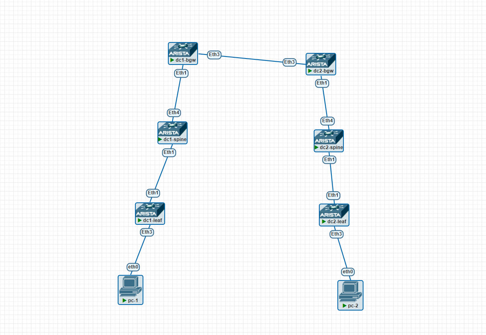

### Проектирование сетевой фабрики на основе VxLAN EVPN и организация связности между 2-мя ДЦ.

### Цели/Задачи
1) Собрать топологию CLOS 
2) Распределить адресное пространство
3) Настройка протоколов динамической маршрутизации.
4) Организация связности между ДЦ.
5) Зафиксировать в документации - план работы, адресное пространство, схему сети, конфигурацию устройств

### Реализация
Схема сети


### ip план

| Устройство | Интерфейс | IP-адрес       | Loopback IP    | Дескрипшен                       |
|------------|-----------|----------------|----------------|----------------------------------|
| dc1-leaf   | eth1      | 10.10.4.0/31   | 4.4.4.4/32     | dc1-spine_et1                    |
| dc1-spine  | eth1      | 10.10.10.2/31  | 10.0.0.1/32    | dc1-leaf_et1                     |
| dc1-spine  | eth4      | 10.10.10.4/31  | 10.0.0.2/32    | dc1-bgw_et2                      |
| dc1-bgw    | eth1      | 10.10.10.6/31  | 10.0.0.2/32    | dc1-spine_et4                    |
| dc1-bgw    | eth3      | 10.10.10.8/31  | 10.0.0.3/32    | dc2-bgw_et3                      |
| dc2-leaf   | eth1      | 10.10.10.10/31 | 10.0.0.3/32    | dc2-spine_et1                    |
| dc2-spine  | eth1      | 10.10.10.12/31 | 10.0.0.6/32    | dc2-leaf_et1                     |
| dc2-spine  | eth4      | 10.10.10.14/31 | 10.0.0.6/32    | dc2-bgw_et1                      |
| dc2-bgw    | eth1      | 10.10.10.1/31  | 10.0.0.4/32    | dc2-spine_et1                    |
| dc2-bgw    | eth3      | 10.10.10.5/31  | 10.0.0.4/32    | dc1-bgw_et3                      |
| PC1        | eth0      | 10.10.10.9/31  | 10.0.0.4/32    | dc1-leaf_et3                     |
| PC2        | eth0      | 10.10.10.13/31 | 10.0.0.4/32    | dc2-leaf_et3                     |

### Конфигурации
<details>
<summary><b>dc1-leaf</b> (нажмите, чтобы раскрыть)</summary>

```cisco
vlan 10
   name v10
!
vrf instance ten-1
!
interface Ethernet1
   no switchport
   bfd interval 100 min_rx 100 multiplier 3
   ip address 10.10.1.0/31
   ip ospf network point-to-point
   ip ospf area 0.0.0.0
!
interface Ethernet2
!
interface Ethernet3
   switchport access vlan 10
!
interface Ethernet4
!
interface Ethernet5
!
interface Ethernet6
!
interface Ethernet7
!
interface Ethernet8
!
interface Loopback0
   ip address 1.1.1.1/32
   ip ospf area 0.0.0.0
!
interface Management1
!
interface Vlan10
   vrf ten-1
   ip address virtual 10.0.10.1/24
!
interface Vxlan1
   vxlan source-interface Loopback0
   vxlan udp-port 4789
   vxlan vlan 10 vni 10010
   vxlan vrf ten-1 vni 10099
!
ip virtual-router mac-address 00:1c:73:00:00:99
!
ip routing
ip routing vrf ten-1
!
router bgp 65100
   router-id 1.1.1.1
   no bgp default ipv4-unicast
   neighbor SPINE peer group
   neighbor SPINE remote-as 65100
   neighbor SPINE update-source Loopback0
   neighbor SPINE send-community extended
   neighbor SPINE bfd interval 100
   neighbor 10.10.10.10 peer group SPINE
   !
   vlan 10
      rd 1.1.1.1:10010
      route-target both 10010:10010
      redistribute learned
   !
   address-family evpn
      neighbor SPINE activate
   !
   vrf ten-1
      rd 1.1.1.1:10099
      route-target import evpn 10099:10099
      route-target export evpn 10099:10099
      redistribute connected
!
router multicast
   ipv4
      software-forwarding kernel
   !
   ipv6
      software-forwarding kernel
!
router ospf 1
   passive-interface default
   no passive-interface Ethernet1
   no passive-interface Ethernet2
   no passive-interface Ethernet3
   bfd default
   max-lsa 12000
!
end
```

</details>

<details>
<summary><b>dc1-spine</b> (нажмите, чтобы раскрыть)</summary>

```cisco
hostname dc1-spine
!
spanning-tree mode mstp
!
system l1
   unsupported speed action error
   unsupported error-correction action error
!
interface Ethernet1
   no switchport
   bfd interval 100 min_rx 100 multiplier 3
   ip address 10.10.1.1/31
   ip ospf network point-to-point
   ip ospf area 0.0.0.0
!
interface Ethernet4
   no switchport
   bfd interval 100 min_rx 100 multiplier 3
   ip address 10.10.4.1/31
   ip ospf network point-to-point
   ip ospf area 0.0.0.0
!
interface Ethernet6
!
interface Ethernet7
!
interface Ethernet8
!
interface Loopback0
   ip address 10.10.10.10/32
   ip ospf area 0.0.0.0
!
interface Management1
!
ip routing
!
router bgp 65100
   router-id 10.10.10.10
   no bgp default ipv4-unicast
   neighbor LEAF peer group
   neighbor LEAF remote-as 65100
   neighbor LEAF update-source Loopback0
   neighbor LEAF route-reflector-client
   neighbor LEAF send-community extended
   neighbor LEAF bfd interval 100
   neighbor 1.1.1.1 peer group LEAF
   neighbor 4.4.4.4 peer group LEAF
  !
   address-family evpn
      neighbor LEAF activate
!
router multicast
   ipv4
      software-forwarding kernel
   !
   ipv6
      software-forwarding kernel
!
router ospf 1
   passive-interface default
   no passive-interface Ethernet1
   no passive-interface Ethernet4
   bfd default
   max-lsa 12000
!
end
```

</details>

<details>
<summary><b>dc1-bgw</b> (нажмите, чтобы раскрыть)</summary>

```cisco
hostname dc1-bgw
!
spanning-tree mode mstp
!
system l1
   unsupported speed action error
   unsupported error-correction action error
!
vlan 10
   name v10
!
vrf instance ten-1
!
interface Ethernet1
   no switchport
   bfd interval 100 min_rx 100 multiplier 3
   ip address 10.10.4.0/31
   ip ospf network point-to-point
   ip ospf area 0.0.0.0
!
interface Ethernet3
   no switchport
   bfd interval 100 min_rx 100 multiplier 3
   ip address 172.16.0.0/31
!
interface Ethernet4
!
interface Ethernet5
!
interface Ethernet6
!
interface Ethernet7
!
interface Ethernet8
!
interface Loopback0
   ip address 4.4.4.4/32
   ip ospf area 0.0.0.0
!
interface Management1
!
interface Vxlan1
   vxlan source-interface Loopback1
   vxlan virtual-router encapsulation mac-address 00:1c:73:00:01:00
   vxlan udp-port 4789
   vxlan vlan 10 vni 10010
   vxlan vrf ten-1 vni 10099
!
ip routing
ip routing vrf ten-1
!
router bgp 65100
   router-id 4.4.4.4
   no bgp default ipv4-unicast
   bgp bestpath d-path
   neighbor DC2-REMOTE peer group
   neighbor DC2-REMOTE remote-as 65200
   neighbor DC2-REMOTE send-community extended
   neighbor DC2-REMOTE bfd interval 100
   neighbor DCI peer group
   neighbor DCI remote-as 65000
   neighbor DCI send-community extended
   neighbor DCI bfd interval 100
   neighbor SPINE peer group
   neighbor SPINE remote-as 65100
   neighbor SPINE update-source Loopback0
   neighbor SPINE send-community extended
   neighbor SPINE bfd interval 100
   neighbor 10.10.10.10 peer group SPINE
   neighbor 172.16.0.1 peer group DC2-REMOTE
   !
   vlan 10
      rd evpn domain all 4.4.4.4:10010
      route-target import export evpn domain all 10010:10010
   !
      address-family evpn
      neighbor DC2-REMOTE activate
      neighbor DC2-REMOTE domain remote
      neighbor DCI activate
      neighbor DCI domain remote
      neighbor SPINE activate
      domain identifier 65100:1
      domain identifier 65000:1 remote
      neighbor default next-hop-self received-evpn-routes route-type ip-prefix inter-domain
   !
   address-family ipv4
      neighbor DC2-REMOTE activate
      neighbor DCI activate
      network 4.4.4.4/32
      network 100.100.100.100/32
   !
   vrf ten-1
      rd 4.4.4.4:10099
      route-target import evpn 10099:10099
      route-target export evpn 10099:10099
!
router multicast
   ipv4
      software-forwarding kernel
   !
   ipv6
      software-forwarding kernel
!
router ospf 1
   passive-interface default
   no passive-interface Ethernet1
   no passive-interface Ethernet2
   bfd default
   max-lsa 12000
!
end
```

</details>

<details>
<summary><b>dc2-bgw</b> (нажмите, чтобы раскрыть)</summary>

```cisco
hostname dc2-bgw
!
spanning-tree mode mstp
!
system l1
   unsupported speed action error
   unsupported error-correction action error
!
vlan 10
   name v10
!
vrf instance ten-1
!
interface Ethernet1
   no switchport
   bfd interval 100 min_rx 100 multiplier 3
   ip address 20.10.4.0/31
   ip ospf network point-to-point
   ip ospf area 0.0.0.0
!
interface Ethernet3
   no switchport
   bfd interval 100 min_rx 100 multiplier 3
   ip address 172.16.0.1/31
!
interface Ethernet4
!
interface Ethernet5
!
interface Ethernet6
!
interface Ethernet7
!
interface Ethernet8
!
interface Loopback0
   ip address 24.4.4.4/32
   ip ospf area 0.0.0.0
!
interface Management1
!
interface Vxlan1
   vxlan source-interface Loopback1
   vxlan virtual-router encapsulation mac-address 00:1c:73:00:02:00
   vxlan udp-port 4789
   vxlan vlan 10 vni 10010
   vxlan vrf ten-1 vni 10099
!
ip routing
ip routing vrf ten-1
!
router bgp 65200
   router-id 24.4.4.4
   no bgp default ipv4-unicast
   bgp bestpath d-path
   neighbor DC1-REMOTE peer group
   neighbor DC1-REMOTE remote-as 65100
   neighbor DC1-REMOTE send-community extended
   neighbor DC1-REMOTE bfd interval 100
   neighbor DCI peer group
   neighbor DCI remote-as 65000
   neighbor DCI send-community extended
   neighbor DCI bfd interval 100
   neighbor SPINE peer group
   neighbor SPINE remote-as 65200
   neighbor SPINE update-source Loopback0
   neighbor SPINE send-community extended
   neighbor SPINE bfd interval 100
   neighbor 172.16.0.0 peer group DC1-REMOTE
   neighbor 210.10.10.10 peer group SPINE
      !
   vlan 10
      rd evpn domain all 24.4.4.4:10010
      route-target import export evpn domain all 10010:10010
   !
     address-family evpn
      neighbor DC1-REMOTE activate
      neighbor DC1-REMOTE domain remote
      neighbor DC1-REMOTE bfd interval 100
      neighbor DCI activate
      neighbor DCI domain remote
      neighbor SPINE activate
      domain identifier 65200:1
      domain identifier 65000:1 remote
      neighbor default next-hop-self received-evpn-routes route-type ip-prefix inter-domain
   !
   address-family ipv4
      neighbor DC1-REMOTE activate
      neighbor DCI activate
      network 24.4.4.4/32
      network 200.200.200.200/32
   !
   vrf ten-1
      rd 24.4.4.4:10099
      route-target import evpn 10099:10099
      route-target export evpn 10099:10099
!
router multicast
   ipv4
      software-forwarding kernel
   !
   ipv6
      software-forwarding kernel
!
router ospf 1
   passive-interface default
   no passive-interface Ethernet1
   no passive-interface Ethernet2
   bfd default
   max-lsa 12000
!
end
```

</details>

<details>
<summary><b>dc2-spine</b> (нажмите, чтобы раскрыть)</summary>

```cisco
hostname dc2-spine
!
spanning-tree mode mstp
!
system l1
   unsupported speed action error
   unsupported error-correction action error
!
interface Ethernet1
   no switchport
   bfd interval 100 min_rx 100 multiplier 3
   ip address 20.10.1.1/31
   ip ospf network point-to-point
   ip ospf area 0.0.0.0
!
!
interface Ethernet4
   no switchport
   bfd interval 100 min_rx 100 multiplier 3
   ip address 20.10.4.1/31
   ip ospf network point-to-point
   ip ospf area 0.0.0.0
!
interface Ethernet6
!
interface Ethernet7
!
interface Ethernet8
!
interface Loopback0
   ip address 210.10.10.10/32
   ip ospf area 0.0.0.0
!
interface Management1
!
ip routing
!
router bgp 65200
   router-id 210.10.10.10
   no bgp default ipv4-unicast
   neighbor LEAF peer group
   neighbor LEAF bfd interval 100
   neighbor LEAF remote-as 65200
   neighbor LEAF update-source Loopback0
   neighbor LEAF route-reflector-client
   neighbor LEAF send-community extended
   neighbor 21.1.1.1 peer group LEAF
   neighbor 24.4.4.4 peer group LEAF
   !
   address-family evpn
      neighbor LEAF activate
!
router multicast
   ipv4
      software-forwarding kernel
   !
   ipv6
      software-forwarding kernel
!
router ospf 1
   passive-interface default
   no passive-interface Ethernet1
   no passive-interface Ethernet4
   bfd default
   max-lsa 12000
!
end
```

</details>

<details>
<summary><b>dc2-leaf</b> (нажмите, чтобы раскрыть)</summary>

```cisco
hostname dc2-leaf
!
spanning-tree mode mstp
!
system l1
   unsupported speed action error
   unsupported error-correction action error
!
vlan 10
   name v10
!
vrf instance ten-1
!
interface Ethernet1
   no switchport
   bfd interval 100 min_rx 100 multiplier 3
   ip address 20.10.1.0/31
   ip ospf network point-to-point
   ip ospf area 0.0.0.0
!
interface Ethernet2
   no switchport
   bfd interval 100 min_rx 100 multiplier 3
   ip address 20.20.1.0/31
   ip ospf network point-to-point
   ip ospf area 0.0.0.0
!
interface Ethernet3
   switchport access vlan 10
!
interface Ethernet4
!
interface Ethernet5
!
interface Ethernet6
!
interface Ethernet7
!
interface Ethernet8
!
interface Loopback0
   ip address 21.1.1.1/32
   ip ospf area 0.0.0.0
!
interface Management1
!
interface Vlan10
   vrf ten-1
   ip address virtual 10.0.10.1/24
!
interface Vxlan1
   vxlan source-interface Loopback0
   vxlan udp-port 4789
   vxlan vlan 10 vni 10010
   vxlan vrf ten-1 vni 10099
!
ip virtual-router mac-address 00:1c:73:00:00:99
!
ip routing
ip routing vrf ten-1
!
router bgp 65200
   router-id 21.1.1.1
   no bgp default ipv4-unicast
   neighbor SPINE peer group
   neighbor SPINE remote-as 65200
   neighbor SPINE update-source Loopback0
   neighbor SPINE send-community extended
   neighbor SPINE bfd interval 100
   neighbor 210.10.10.10 peer group SPINE
   neighbor 220.20.20.20 peer group SPINE
   !
   vlan 10
      rd 21.1.1.1:10010
      route-target both 10010:10010
      redistribute learned
   !
   address-family evpn
      neighbor SPINE activate
   !
   vrf ten-1
      rd 21.1.1.1:10099
      route-target import evpn 10099:10099
      route-target export evpn 10099:10099
      redistribute connected
!
router multicast
   ipv4
      software-forwarding kernel
   !
   ipv6
      software-forwarding kernel
!
router ospf 1
   passive-interface default
   no passive-interface Ethernet1
   no passive-interface Ethernet2
   bfd default
   max-lsa 12000
!
end
```

</details>

### Проверка связности
```cisco
dc1-leaf#sh bgp evpn route-type mac-ip
BGP routing table information for VRF default
Router identifier 1.1.1.1, local AS number 65100
Route status codes: * - valid, > - active, S - Stale, E - ECMP head, e - ECMP
                    c - Contributing to ECMP, % - Pending best path selection
Origin codes: i - IGP, e - EGP, ? - incomplete
AS Path Attributes: Or-ID - Originator ID, C-LST - Cluster List, LL Nexthop - Link Local Nexthop

          Network                Next Hop              Metric  LocPref Weight  Path
 * >      RD: 1.1.1.1:10010 mac-ip 0050.7966.6824
                                 -                     -       -       0       i
 * >      RD: 1.1.1.1:10010 mac-ip 0050.7966.6824 10.0.10.2
                                 -                     -       -       0       i
 * >      RD: 4.4.4.4:10010 mac-ip 0050.7966.6825
                                 100.100.100.100       -       100     0       65200 i Or-ID: 4.4.4.4 C-LST: 10.10.10.10
 * >      RD: 4.4.4.4:10010 mac-ip 0050.7966.6825 10.0.10.3
                                 100.100.100.100       -       100     0       65200 i Or-ID: 4.4.4.4 C-LST: 10.10.10.10
dc1-leaf#
dc1-leaf#
dc1-leaf#
dc1-leaf#
dc1-leaf#sh bgp su
BGP summary information for VRF default
Router identifier 1.1.1.1, local AS number 65100
Neighbor             AS Session State AFI/SAFI                AFI/SAFI State   NLRI Rcd   NLRI Acc
----------- ----------- ------------- ----------------------- -------------- ---------- ----------
10.10.10.10       65100 Established   L2VPN EVPN              Negotiated              4          4


dc2-bgw# sh bgp su
BGP summary information for VRF default
Router identifier 24.4.4.4, local AS number 65200
Neighbor              AS Session State AFI/SAFI                AFI/SAFI State   NLRI Rcd   NLRI Acc
------------ ----------- ------------- ----------------------- -------------- ---------- ----------
172.16.0.0         65100 Established   IPv4 Unicast            Negotiated              2          2
172.16.0.0         65100 Established   L2VPN EVPN              Negotiated              3          3
210.10.10.10       65200 Established   L2VPN EVPN              Negotiated              2          2
dc2-bgw#sh bgp evpn route-type mac-ip
BGP routing table information for VRF default
Router identifier 24.4.4.4, local AS number 65200
Route status codes: * - valid, > - active, S - Stale, E - ECMP head, e - ECMP
                    c - Contributing to ECMP, % - Pending best path selection
Origin codes: i - IGP, e - EGP, ? - incomplete
AS Path Attributes: Or-ID - Originator ID, C-LST - Cluster List, LL Nexthop - Link Local Nexthop

          Network                Next Hop              Metric  LocPref Weight  Path
 * >      RD: 24.4.4.4:10010 mac-ip 0050.7966.6824
                                 -                     -       100     0       65100 i
 * >      RD: 24.4.4.4:10010 mac-ip 0050.7966.6824 10.0.10.2
                                 -                     -       100     0       65100 i
 * >      RD: 21.1.1.1:10010 mac-ip 0050.7966.6825
                                 21.1.1.1              -       100     0       i Or-ID: 21.1.1.1 C-LST: 210.10.10.10
 * >      RD: 21.1.1.1:10010 mac-ip 0050.7966.6825 10.0.10.3
                                 21.1.1.1              -       100     0       i Or-ID: 21.1.1.1 C-LST: 210.10.10.10
 * >      RD: 4.4.4.4:10010 mac-ip 0050.7966.6824 remote
                                 100.100.100.100       -       100     0       65100 i
 * >      RD: 4.4.4.4:10010 mac-ip 0050.7966.6824 10.0.10.2 remote
                                 100.100.100.100       -       100     0       65100 i
 * >      RD: 24.4.4.4:10010 mac-ip 0050.7966.6825 remote
                                 -                     -       100     0       i Or-ID: 21.1.1.1 C-LST: 210.10.10.10
 * >      RD: 24.4.4.4:10010 mac-ip 0050.7966.6825 10.0.10.3 remote


PC-2> sh ip

NAME        : VPCS[1]
IP/MASK     : 10.0.10.3/24
GATEWAY     : 10.0.10.1
DNS         : 
MAC         : 00:50:79:66:68:25
LPORT       : 20000
RHOST:PORT  : 127.0.0.1:30000
MTU         : 1500

PC-2> ping 10.0.10.2

84 bytes from 10.0.10.2 icmp_seq=1 ttl=64 time=16.742 ms
84 bytes from 10.0.10.2 icmp_seq=2 ttl=64 time=6.755 ms
84 bytes from 10.0.10.2 icmp_seq=3 ttl=64 time=6.612 ms
84 bytes from 10.0.10.2 icmp_seq=4 ttl=64 time=7.239 ms
84 bytes from 10.0.10.2 icmp_seq=5 ttl=64 time=6.407 ms

VPCS> sh ip 

NAME        : VPCS[1]
IP/MASK     : 10.0.10.2/24
GATEWAY     : 10.0.10.1
DNS         : 
MAC         : 00:50:79:66:68:24
LPORT       : 20000
RHOST:PORT  : 127.0.0.1:30000
MTU         : 1500

VPCS> ping 10.0.10.3

84 bytes from 10.0.10.3 icmp_seq=1 ttl=64 time=8.541 ms
84 bytes from 10.0.10.3 icmp_seq=2 ttl=64 time=6.733 ms


